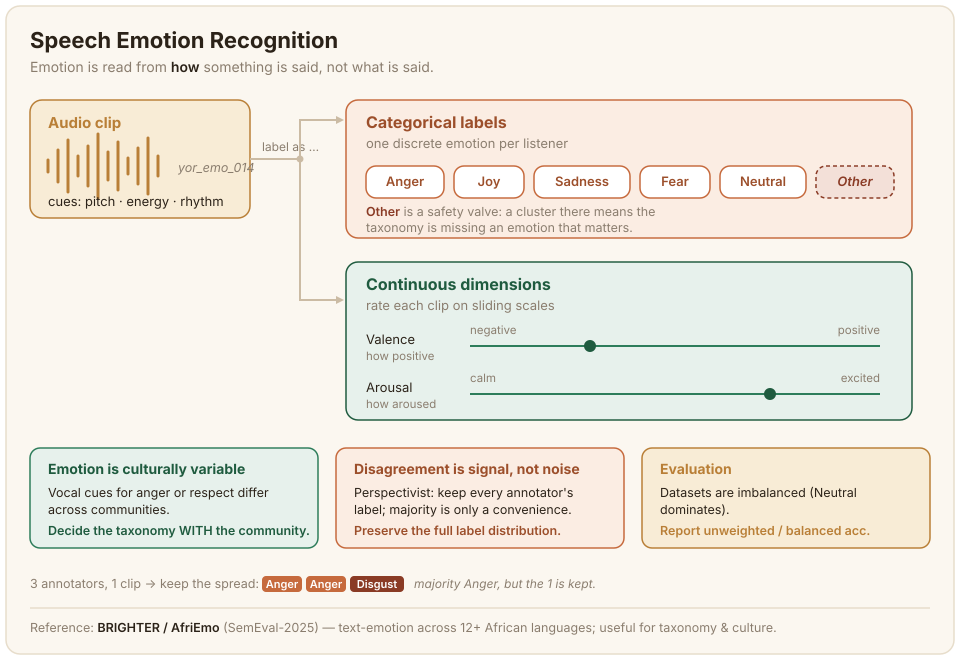

# Speech Emotion Recognition

Speech emotion recognition (SER) reads emotion from how something is said rather than what is said, from pitch, energy, and rhythm. It is one of the most subjective and culturally variable tasks in the playbook, and dedicated African speech-emotion data is still scarce, which makes how you design the annotation more important than the size of the dataset.

This page is the practical guide to building SER data and models where the community's own understanding of emotional expression is load-bearing on the corpus. For the shared recording and consent groundwork see the [Speech overview](../sections/speech.md); for text-side emotion detection see the [emotion analysis](../11_text-classification/emotion-analysis.md) chapter under text classification.



## What SER is really doing, and why it is culturally load-bearing

Unlike ASR or diarization, SER is not extracting an objective property of the audio; it is asking human listeners a question about their subjective interpretation of vocal cues. That means the corpus does not represent "the true emotion in the audio" — it represents "how listeners from this community hear this audio." That framing has three consequences that shape every downstream decision.

- **The right corpus for the deployment target is a corpus labelled by listeners from that community.** A model trained on Yoruba emotion labelled by American undergraduates will silently misclassify Yoruba speakers in deployment, because the labels do not reflect how Yoruba speakers themselves hear their own vocal cues. Recruit annotators from the specific community whose language and culture the deployment target serves.
- **Emotion categories are cultural constructs.** The six-class Ekman set (anger, joy, sadness, fear, disgust, surprise) is a Western psychological-tradition taxonomy, widely used because it exists — but it under-serves the range of emotional expression many African-language communities distinguish. Respect, shame, obligation, and modes of anger that are distinct in some communities collapse into single Western categories. Build the taxonomy with the community, not from a paper.
- **Disagreement is not noise.** In a task that measures subjective interpretation, two listeners hearing the same clip as "anger" and "disgust" respectively is a fact about how the audio sounds, not an annotation error. The corpus should preserve the disagreement rather than force a single label.

## What the data looks like

SER data is audio clips labelled with an emotion, either as categories such as anger, joy, or sadness, or along continuous dimensions such as how positive and how aroused the speaker sounds. The shortage of African speech-emotion corpora means most work starts from scratch or borrows from related text-emotion efforts: the BRIGHTER and AfriEmo datasets behind SemEval-2025's emotion task cover emotion in text across more than a dozen African languages and are a useful reference for taxonomy and culture, even though they are text rather than speech ([BRIGHTER, 2025](../references.md#brighter-2025)). The deeper difficulty is that emotional expression is cultural. The vocal cues that read as anger or as respect vary across communities, and an emotion taxonomy built for English speakers may not fit how a given African language and culture expresses feeling. Decide the taxonomy with the community, not for it.

Because disagreement is meaningful here, the data format should keep every annotator's label rather than collapsing to one. Storing the full set, with a majority only as a convenience field, lets later work train against the distribution:

```json
{
  "audio_filepath": "clips/yor_emo_014.wav",
  "language": "yor",
  "duration": 2.7,
  "labels": [
    {"annotator": "ann_01", "emotion": "Anger"},
    {"annotator": "ann_02", "emotion": "Disgust"},
    {"annotator": "ann_03", "emotion": "Anger"}
  ],
  "majority": "Anger"
}
```

The two-out-of-three split here is not noise to be cleaned away: it records that the clip genuinely sounds angry to most listeners and disgusted to one, which is exactly the kind of variation the next section treats as signal.

**Continuous-dimension SER** (valence–arousal regression, as in DimABSA's stance track) is worth mentioning as an alternative to categorical labels. Instead of picking one of five emotions, listeners rate each clip on a 1–5 scale for valence (negative to positive) and arousal (calm to activated). The dimensional approach avoids the taxonomy-fitting problem, at the cost of being harder to explain to non-expert users and harder to act on downstream. Where the deployment target needs a discrete category (a customer-service triage tool), stick with categorical; where the target is finer-grained analysis (health monitoring, research on emotional response), dimensional is often more honest.

## Data collection

Recording SER data has to satisfy two conflicting demands. The audio must be authentic enough to carry recognisable emotional signal, but constrained enough to be evaluable — a corpus of found-in-the-wild emotional audio is impossible to annotate systematically. Two collection methods dominate.

- **Acted emotion recording.** Speakers are asked to produce a set of prompts each with a specific target emotion ("read this sentence as if you were angry"). Simple to organise, easy to annotate, but produces stylised performances that generalise poorly to spontaneous speech. Reference for prototype work; not sufficient for production.
- **Naturalistic emotion sampling.** Extract emotional segments from existing recordings — radio talk shows, community meetings, focus groups, health-worker debriefs — and annotate. More expensive per hour of usable data (much of a source recording is emotionally neutral or ambiguous), but produces audio that reflects real user input.

The pragmatic hybrid is to build an initial corpus from acted recordings for coverage of rare emotions, then expand with naturalistic sampling from real deployment-adjacent audio. Match the naturalistic collection to the deployment surface: SER for call-centre customer-service triage needs call-centre-audio training, not radio-talk-show training.

**Consent for emotional audio needs extra care.** A speaker who consented to have their voice recorded may not have consented to having their emotional state characterised and labelled by strangers. Extend the consent conversation to cover the specific emotion-labelling use case, including that annotators from outside the speaker's community may be labelling their voice.

## Annotation: disagreement is part of the signal

Because emotion is subjective, SER is the clearest case for the perspectivist approach from [Annotation Design](../3_annotation-design/workflow-adjudication.md). Several annotators from the relevant community should label each clip, and when they disagree, that disagreement often reflects genuine variation in how people hear emotion rather than error. Recruit annotators across the dialects and backgrounds of the speaker community, record their context where consented, and consider preserving the spread of labels rather than collapsing it to a single emotion. Annotator wellbeing matters here too, since some emotional audio is distressing to label.

The labeling config is deliberately simple, one emotion per listener, so that several annotators each contribute one label per clip and the spread is preserved across their submissions rather than within one:

```xml
<View>
  <Audio name="audio" value="$audio"/>
  <Header value="Which emotion best fits how this is said?"/>
  <Choices name="emotion" toName="audio" choice="single" required="true">
    <Choice value="Anger"   hotkey="1"/>
    <Choice value="Joy"     hotkey="2"/>
    <Choice value="Sadness" hotkey="3"/>
    <Choice value="Fear"    hotkey="4"/>
    <Choice value="Neutral" hotkey="5"/>
    <Choice value="Other, not listed" hotkey="9"/>
  </Choices>
</View>
```

The `Other, not listed` choice is a safety valve while the taxonomy is still being settled with the community: a cluster of clips landing there is a sign the label set is missing an emotion that matters in this language.

**Annotator wellbeing during SER labelling.** Repeated listening to emotionally intense audio — distress, grief, fear, anger — is harmful to annotators in a way that is well-documented from content-moderation labour ([Roberts, 2019](https://yalebooks.yale.edu/9780300235883/behind-the-screen)). SER projects should apply the same wellbeing infrastructure the [hate speech Before-You-Start page](../before-you-start/hate-speech.mdx#annotator-wellbeing-non-negotiable) requires: bounded exposure per day, access to counselling, team debriefs, rotation and opt-out without penalty, fair pay reflecting the harm of the work. Skipping these because SER is not obviously as harmful as hate-speech labelling is a mistake: emotional-audio annotation at scale is distress-adjacent labour.

**Four annotation conventions to fix in writing:**

- **What counts as "neutral"?** The default background category. Fix a working definition so annotators don't drift — is "neutral" the absence of strong emotion, or a specific calm register? Both are defensible; document which.
- **How to handle mixed emotions?** A clip that reads as both sad and angry — one label, both labels, "Other, not listed"? Decide the policy.
- **Speaker-vs-content emotion.** A clip where a calm speaker relates a distressing event — is the emotion the speaker's calm delivery, or the content's distress? Almost always the speaker's delivery, but document explicitly.
- **Cultural markers of respect and deference.** Many African-language cultures have distinct vocal markers for respect toward elders or authority that Western taxonomies fold into "neutral" or "fear." Include these as separate categories where the community recognises them.

## Evaluation

SER is evaluated with accuracy and [F1](https://scikit-learn.org/stable/modules/generated/sklearn.metrics.f1_score.html), but because emotion datasets are usually imbalanced, with neutral clips far outnumbering strong emotions, report unweighted ([balanced](https://scikit-learn.org/stable/modules/model_evaluation.html#balanced-accuracy-score)) accuracy alongside weighted accuracy so that good performance on the common classes cannot hide poor performance on the rare ones. Where the data preserves multiple annotators, evaluating against the distribution of human labels is more honest than forcing a single answer.

The gap between the two accuracy figures is what reveals a model coasting on the majority class:

```python
from sklearn.metrics import accuracy_score, balanced_accuracy_score, f1_score

y_true = ["Neutral", "Neutral", "Anger", "Joy", "Neutral", "Sadness"]
y_pred = ["Neutral", "Neutral", "Neutral", "Joy", "Neutral", "Neutral"]

# Weighted: rewards getting the common 'Neutral' class right.
print(f"weighted accuracy:   {accuracy_score(y_true, y_pred):.3f}")
# Unweighted: averages per-class, so failing rare emotions shows up.
print(f"balanced accuracy:   {balanced_accuracy_score(y_true, y_pred):.3f}")
print(f"macro F1:            {f1_score(y_true, y_pred, average='macro'):.3f}")
```

Here plain accuracy looks respectable while balanced accuracy and macro F1 fall sharply, because the model labels almost everything neutral and is right only on the class that dominates the data. Reporting the unweighted number alongside the weighted one keeps that failure visible, which matters most for the strong but rare emotions a useful SER system actually needs to catch.

**Beyond aggregate metrics.** Aggregate F1 hides where a model fails; SER is unusually susceptible because emotion recognition performance varies steeply across subgroups.

- **Per-emotion F1.** Report every class separately with class support. A model whose macro F1 is acceptable but whose "Fear" F1 is 0.15 has a class-specific problem the aggregate hides.
- **Per-speaker-demographic F1.** Split by speaker gender and age band. Emotion-recognition models routinely perform worse on female voices, younger voices, and older voices than on the middle-aged male voices that dominate most training corpora. Report these splits and address imbalance in the training set.
- **Per-dialect F1.** Kiswahili emotion labelled by Tanzanian annotators may not transfer to Kenyan-coastal Kiswahili speakers. Report separately if the deployment covers multiple varieties.
- **Distribution match.** When the corpus preserves per-annotator labels, evaluate the model's predicted probability distribution against the distribution of human labels (KL divergence or JSD), not just against the majority label. A model that always predicts the majority label matches accuracy but fails the perspective-preservation the corpus was built for.

## Deployment realities

- **Very high false-positive costs.** SER deployed as an automated content moderator ("this call sounds angry, escalate") produces false positives that harm the users it flags. A calm speaker discussing an angry topic gets flagged; a customer's frustrated tone gets escalated to a supervisor. Deployment must include human review of borderline cases and an appeal process; automated SER-based escalation is not a responsible default.
- **Health-adjacent deployment needs medical-grade rigor.** SER for depression screening, PTSD monitoring, or clinical mental-health triage is subject to jurisdiction-specific medical-device regulation and clinical-validation requirements. The [legal, consent, and community IP](../legal-consent/index.md) chapter is the framework starting point; jurisdiction-specific medical-data compliance layers on top.
- **Cultural drift over time.** Emotion norms shift generationally. A corpus labelled in 2020 by then-current annotators may not reflect how 2028 speakers hear the same clips. SER models degrade in this way silently — track deployment performance against re-collected human labels on a cadence.
- **On-device SER is unusual.** Most deployment surfaces call SER server-side because the models benefit from larger context and richer feature extraction. On-device SER is possible for constrained use cases (voice-assistant tone adaptation) but rarely the deployment path.

## What breaks — common failure modes

- **Out-of-community annotators produce a corpus that fits nobody.** Model trained on the corpus performs poorly on the community's own users. Fix: recruit annotators from the specific community.
- **Ekman-taxonomy corpus that misses culturally distinct emotions.** Cluster of "Other, not listed" flags in the corpus reveals categories the community distinguishes that the taxonomy didn't include. Fix: iterate the taxonomy with the community as annotation surfaces its limits.
- **Aggregate accuracy hiding rare-emotion collapse.** Weighted accuracy is 80%; balanced accuracy is 45%. Fix: balanced accuracy or macro F1 as the headline metric.
- **Gender and age imbalance in training data.** Model performs 15 F1 points worse on female voices than on male. Fix: track and enforce demographic balance in the training set; report per-demographic F1.
- **Cultural marker collapsed into a Western category.** A distinct respectful-address register the community recognises gets labelled as "neutral" by out-of-community annotators. Fix: distinct category in the taxonomy from the start.
- **Annotator distress accumulating silently.** Repeated exposure to emotionally intense audio produces stress in annotators nobody is tracking. Fix: same wellbeing infrastructure hate-speech projects use — bounded exposure, counselling, opt-out, fair pay.
- **Deployed as automated escalation without human review.** SER flags "angry" call, system auto-escalates; user experiences the flag as accusatory. Fix: SER-based automated action needs human-in-the-loop review, appeal process, and disaggregated false-positive tracking.
