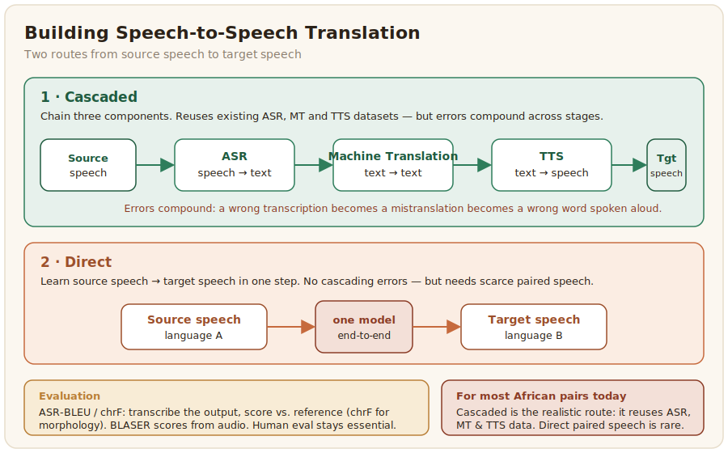

# Speech-to-Speech Translation

Speech-to-speech translation (S2ST) takes speech in one language and produces speech in another, the spoken equivalent of a human interpreter. For African languages it is the most ambitious speech task and the least resourced, because it sits on top of three hard tasks at once. This page is short by necessity: dedicated African S2ST data barely exists yet, so the practical advice is about how to assemble it from the pieces you do have.



## Cascaded and direct, and what each needs

There are two ways to build S2ST. A cascaded system chains three components, ASR to transcribe the source speech, machine translation to translate the text, and TTS to speak the result, while a direct system learns to map source speech to target speech in one step. For African languages the cascaded route is almost always the realistic one today, because it can reuse the ASR, MT, and TTS datasets covered elsewhere in this section rather than requiring scarce end-to-end speech-translation pairs. The cost of cascading is that errors compound: a mistake in transcription becomes a mistranslation becomes a wrong word spoken aloud. Direct systems avoid that but need paired source-and-target speech that, for most African language pairs, no one has collected.

## Building the data

If you collect S2ST data directly, the unit is aligned speech across two languages, the same utterance spoken in the source and in the target, with a transcript on each side for training and evaluation. This is expensive, so most projects start cascaded and compose existing resources: an ASR corpus for the source language, a parallel text corpus for the pair (see [Machine Translation](../machine-translation/index.md)), and a TTS corpus for the target. Where you do collect end-to-end data, treat consent and voice rights as you would for TTS, since the target side is synthesised or re-spoken speech.

## Evaluation

S2ST is usually evaluated by transcribing the spoken output and scoring that text against a reference translation, an approach often called ASR-BLEU, with chrF preferred over BLEU for the same morphology reasons as in text translation. Newer speech-aware metrics such as BLASER score the translation directly from the audio. None of these captures whether the output sounds natural and says the right thing, so human evaluation by people fluent in both languages remains essential.

The ASR-BLEU approach is two steps: transcribe the spoken output with an ASR model, then score that text against the reference translation, using chrF for the same morphology reasons as in text translation:

```python
# pip install sacrebleu  (plus an ASR model for the target language)
import sacrebleu

# Step 1: run ASR on the synthesized target-language audio to get text.
#   hypotheses = [asr_model.transcribe(path) for path in generated_audio]
hypotheses = ["asibitin yana budewa da karfe takwas na safe"]
references = [["asibitin yana budewa da karfe takwas da safe"]]

# Step 2: score the transcribed output against the reference translation.
chrf = sacrebleu.corpus_chrf(hypotheses, references)
print(f"ASR-chrF: {chrf.score:.2f}")
```

One caution specific to this cascade: the score now blends two error sources, the translation and the ASR model used to read it back, so a poor number can mean a bad translation or simply a weak target-language recognizer. For most African target languages the ASR step is itself under-resourced, so interpret ASR-BLEU as a loose proxy and lean harder on the human evaluation than you would for text translation.
