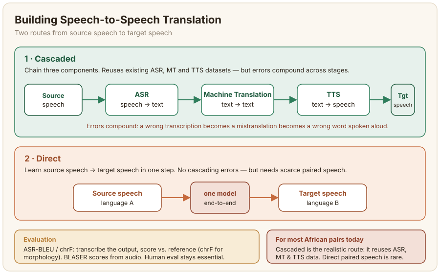

# Speech-to-Speech Translation

Speech-to-speech translation (S2ST) takes speech in one language and produces speech in another, the spoken equivalent of a human interpreter. For African languages it is the most ambitious speech task and the least resourced, because it sits on top of three hard tasks at once. This page is the practical guide to how to assemble a working system from the pieces that exist, how to evaluate it honestly, and what has to be true before deployment.

For the higher-level MT and ASR and TTS decisions this task composes, start with [Before You Start · MT](../before-you-start/machine-translation.mdx), [Before You Start · ASR](../before-you-start/asr.mdx), and [Before You Start · TTS](../before-you-start/tts.mdx). This page details how the three fit together, and the deep-dive decisions specific to speech-in-speech-out.



## Cascaded and direct, and what each needs

There are two ways to build S2ST. A **cascaded** system chains three components — ASR to transcribe the source speech, machine translation to translate the text, TTS to speak the result — while a **direct** system learns to map source speech to target speech in one step. For African languages the cascaded route is almost always the realistic one today, because it can reuse the ASR, MT, and TTS datasets covered elsewhere in this section rather than requiring scarce end-to-end speech-translation pairs.

The cost of cascading is that errors compound: a mistake in transcription becomes a mistranslation becomes a wrong word spoken aloud. Direct systems avoid that but need paired source-and-target speech that, for most African language pairs, no one has collected.

The landscape has shifted since 2023. **Meta SeamlessM4T** ([Seamless Communication Team, 2023](https://arxiv.org/abs/2308.11596)) is a foundation model covering many-to-many speech-to-speech and speech-to-text translation across ~100 languages, with modest African coverage; **CVSS-C** ([Jia et al., 2022](https://arxiv.org/abs/2201.03713)) is a large parallel speech-to-speech corpus derived from Common Voice with TTS-synthesised target sides. Direct S2ST is no longer purely research-grade — the models exist and can be fine-tuned for language pairs they don't natively cover. Cascaded remains the default for most African pairs; direct is worth measuring where SeamlessM4T's coverage is close and your team can afford to human-evaluate the tradeoff.

## What African-language S2ST actually varies on

Two axes matter more than the specific model choice.

- **Tone preservation across the language boundary.** If the target language is tonal (Yoruba, Igbo, most Bantu) and the source language is not (English, French, standard Arabic), the tone information in the target must come from the translation and TTS stages — it is not present in the source audio at all. A pipeline that treats target-side tone as "just another diacritic to preserve" will produce tone-flat synthesised speech. Conversely, if the source is tonal and the target is not, the ASR must transcribe tone faithfully or the translation loses the lexical distinctions the tone carried.
- **Code-switching on either side.** Real African-language conversation code-switches with English, French, Arabic, or a regional lingua franca. A source-side monolingual ASR fails on code-switched input; a source-side ASR that handles code-switching then hands the translator a document whose language ID is genuinely mixed, which MT models trained on strict-monolingual data fail on. Design the cascade to handle code-switching end-to-end or budget an explicit code-switching layer at each stage.

## Building the data

If you collect S2ST data directly, the unit is aligned speech across two languages: the same utterance spoken in the source and in the target, with a transcript on each side for training and evaluation. This is expensive, so most projects start cascaded and compose existing resources — an ASR corpus for the source language, a parallel text corpus for the pair (see [Machine Translation](../machine-translation/index.md)), and a TTS corpus for the target.

Where you do collect end-to-end data, treat consent and voice rights as you would for TTS, since the target side is synthesised or re-spoken speech. Voice-consent conversations must cover both sides of the pair explicitly — a speaker whose source-language voice is recorded may not have consented to their voice being used to produce target-language output.

**For direct-S2ST corpus building**, the CVSS-C recipe is the reference: take an existing text-parallel corpus (LAFAND-MT for African-English pairs, say), synthesise the target side with a TTS model, verify a sample with native listeners, and release the aligned triple (source speech, source transcript, target speech). This is not "real" end-to-end data — the target speech is synthesised — but it is enough to fine-tune a direct S2ST model past the point where cascading is obviously better.

**For a genuinely end-to-end corpus** (real target-side speech, not TTS-synthesised), the collection method is expensive: professional interpreters produce the target-side recording in a controlled setting, aligned utterance-by-utterance to the source recording. Budget accordingly — this is closer to a TTS-scale corpus effort than an ASR-scale one, and it must satisfy the voice-consent framework for both source and target speakers.

## Evaluation

S2ST is usually evaluated by transcribing the spoken output and scoring that text against a reference translation, an approach often called ASR-BLEU, with chrF preferred over BLEU for the same morphology reasons as in text translation. Newer speech-aware metrics such as BLASER ([Chen et al., 2023](https://arxiv.org/abs/2212.08486)) score the translation directly from the audio, sidestepping the ASR-in-the-metric problem. None of these captures whether the output sounds natural and says the right thing, so human evaluation by people fluent in both languages remains essential.

The ASR-BLEU approach is two steps: transcribe the spoken output with an ASR model, then score that text against the reference translation, using chrF for the same morphology reasons as in text translation:

```python
# pip install sacrebleu  (plus an ASR model for the target language)
import sacrebleu

# Step 1: run ASR on the synthesized target-language audio to get text.
#   hypotheses = [asr_model.transcribe(path) for path in generated_audio]
hypotheses = ["asibitin yana budewa da karfe takwas na safe"]
references = [["asibitin yana budewa da karfe takwas da safe"]]

# Step 2: score the transcribed output against the reference translation.
chrf = sacrebleu.corpus_chrf(hypotheses, references)
print(f"ASR-chrF: {chrf.score:.2f}")
```

One caution specific to this cascade: the score now blends two error sources, the translation and the ASR model used to read it back, so a poor number can mean a bad translation or simply a weak target-language recognizer. For most African target languages the ASR step is itself under-resourced, so interpret ASR-BLEU as a loose proxy and lean harder on the human evaluation than you would for text translation.

**A better metric bundle** — for a defensible release, report all three:

- **ASR-chrF** (as above) — the classical proxy; useful for tracking training progress.
- **BLASER** — reads the audio directly, so the ASR-in-the-metric problem disappears; still not a substitute for human eval.
- **Human evaluation** — bilingual listeners rate three axes on a 1–5 scale: **adequacy** (does the target speech convey the source meaning?), **fluency** (does the target speech sound natural?), and **acoustic quality** (is the synthesised voice clear and pleasant?). Two evaluators per clip minimum; adjudicate disagreements. Budget one person-week per 200 evaluated clips.

**Evaluate the cascade honestly.** In a cascaded system, aggregate ASR-chrF is not enough. Report the per-stage error: ASR CER on the source recognition, chrF on the intermediate translation (against a reference text translation), then ASR-chrF end-to-end. This isolates where errors compound and lets you invest fixing effort at the right stage.

**Code-switched evaluation.** Real African user input code-switches. Split evaluation into monolingual-source and code-switched-source subsets and report separately. A model whose monolingual ASR-chrF is acceptable and whose code-switched ASR-chrF is catastrophic will silently under-serve most real users.

## Deployment realities

- **Latency budget.** Real-time S2ST for conversation needs sub-second latency on each utterance; cascaded systems accumulate latency across three model calls plus network round-trips. Direct S2ST with a single model call is often lower-latency, when its quality is acceptable. Design the target UX first (real-time interpretation? batched translation of recorded content?) then choose cascade vs direct with the latency target in mind.
- **Compute cost per interaction.** Three model calls per input in a cascade is 3× the inference cost of a single-model direct system, though each stage is often smaller than a single mega-model. For at-scale deployment (a customer-service bot handling thousands of calls per day), the difference matters.
- **Cascade failure isolation is a feature.** When a cascaded system produces bad output, you can inspect each stage's intermediate result and pinpoint which stage failed. Direct systems are more opaque — a wrong output is a wrong output with no clear diagnosis. For production deployment with SLAs and error triage, the cascade's diagnostic transparency is often worth the quality tradeoff.
- **Voice-cloning risk on the target side.** Direct S2ST or TTS-based cascade targets can be trained to produce a specific voice; the same voice-cloning consent conversation from [TTS · Voice consent](../text-to-speech/index.md#distinctive-annotation-and-consent) applies here. The consent conversation must cover the voice used to produce target-language output, distinct from the voice of the source speaker.
- **Streaming vs full-utterance.** Cascaded systems typically need the full source utterance before starting; direct systems can be streaming-capable if the model supports it. Simultaneous interpretation is a research problem, not yet a solved production capability for African language pairs.

## What breaks — common failure modes

- **Error compounding in cascade collapse.** ASR miss-transcribes a critical word, MT translates the mistake fluently, TTS speaks it convincingly. The user hears a natural-sounding wrong answer. Fix: per-stage error tracking with human eval at the intermediate MT stage, so ASR errors surface before they propagate.
- **Tone-flat target speech.** Target language is tonal, tone information gets stripped somewhere in the pipeline (source ASR doesn't preserve it, MT normalises it away, TTS lacks tone marks in prompts). Result: right words, wrong meaning. Fix: audit tone preservation at every stage, not just the final output.
- **Code-switching collapse.** Source is code-switched, monolingual source ASR fails, cascade cannot recover. Fix: source ASR must be code-switching-aware, or code-switching in the source needs explicit pre-processing (split into monolingual segments, translate separately, re-assemble).
- **Voice mismatch.** Direct S2ST or voice-cloned cascade target changes the perceived speaker identity in ways that confuse listeners (e.g., a male source speaker's translation is produced in a female voice). Fix: match target voice deliberately or normalise to a single canonical target voice per language.
- **Speaker consent gap on the target side.** A voice used to record target-language TTS training data (or to clone in a direct S2ST) has not consented to the specific S2ST use case. Fix: the consent conversation must cover S2ST use cases explicitly; retroactive extension is not consent.
- **Aggregate metrics hiding per-domain collapse.** Overall ASR-chrF looks acceptable; per-domain breakdown reveals catastrophic failure on informal-register speech or on domain-specific vocabulary. Fix: per-domain evaluation is not optional; if the deployment target is customer service, evaluate on customer-service audio, not on news.
- **Cost surprise at scale.** A cascade that works in a demo blows up the cloud-compute bill when deployed to thousands of concurrent users. Fix: cost model the cascade at deployment scale during scoping; if the numbers don't work, consider a direct-model path or a lighter cascade.
