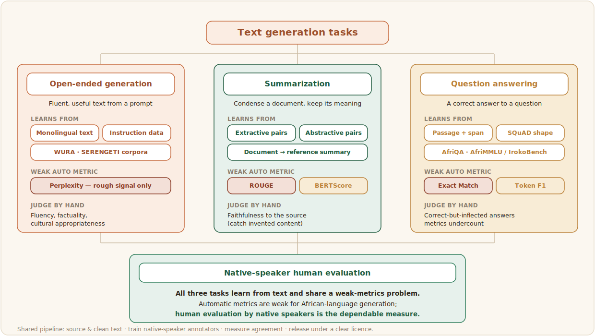

# Text Generation

Text generation covers the tasks where a model produces language rather than just labelling it: writing open-ended text, summarising a longer document, and answering questions. These are the tasks closest to what people picture when they think of modern language models, and they are where African languages fall furthest behind, because generation needs both large, clean text to learn from and careful human data to steer and check it. Benchmarks that test large language models across the continent find a persistent gap between English and African languages on exactly these tasks ([AfroBench](../references.md#afrobench)).

This chapter covers three generation tasks:

- **[Open-ended generation](./generation.md)**: producing fluent, useful text from a prompt.
- **[Summarization](./summarization.md)**: condensing a document while keeping its meaning.
- **[Question answering](./question-answering.md)**: returning a correct answer to a question, from a passage or from the model's own knowledge.

## What the three tasks share

The pages that follow differ mainly in what the data looks like and how it is scored. The rest of the pipeline is shared, and it is the pipeline this playbook has already covered. Source and clean the text with care for African scripts and web noise (see [Data Collection](../2_data-collection/1_data-modalities.md) and [Data Quality](../4_data-quality/index.md)). Design the annotation task and train native-speaker annotators (see [Annotation Design](../3_annotation-design/annotation-task-design.md)). Assure quality and measure agreement, then release under a clear, community-respecting licence (see [Data Governance](../data-governance/index.md)). The three task pages below concentrate on what is distinctive to each: its definition, its data sources, and its evaluation. One theme runs through all of them: automatic metrics are weak for African-language generation, and native-speaker human evaluation is the dependable measure.
