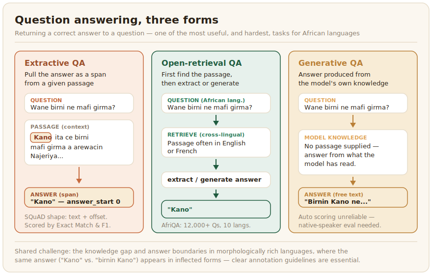

# Question answering

Question answering returns a correct answer to a question. It takes three main forms. Extractive QA pulls the answer as a span from a given passage, open-retrieval QA first finds the relevant passage and then extracts or generates the answer, and generative QA produces an answer from the model's own knowledge. QA is one of the most useful tasks for African languages, because it turns a pile of documents into something a person can actually ask, and it is also one where current models struggle most.



## What the data looks like

The landmark resource is AfriQA, the first cross-lingual open-retrieval QA dataset focused on African languages, with more than 12,000 questions across ten languages, where the question is asked in the African language and the answer is retrieved from passages that are often in English or French ([Ogundepo et al., 2023](../references.md#afriqa-2023)). That cross-lingual design is itself a response to scarcity, since there is far more reference text in English than in most African languages. Knowledge-style QA is covered by AfriMMLU within the IrokoBench benchmark, which tests multiple-choice knowledge questions across seventeen languages ([Adelani et al., 2024](../references.md#irokobench-2024)). Building new QA data means writing questions and marking correct answers, work that has to be done by people fluent in the language and, for specialised domains, in the subject.

Extractive QA data follows the shape made common by SQuAD: a context passage, a question, and the answer marked as both its text and its start position in the passage, so the span can be checked exactly. Recording the character offset, not just the text, removes ambiguity when the same string appears more than once:

```json
{
  "context": "Kano ita ce birni mafi girma a arewacin Najeriya, kuma cibiyar kasuwanci ce.",
  "question": "Wane birni ne mafi girma a arewacin Najeriya?",
  "answers": [{"text": "Kano", "answer_start": 0}],
  "language": "hau_Latn"
}
```

For unanswerable questions, which are worth including so a model learns to decline rather than invent, keep an empty `answers` list. The annotation guideline on exactly where an answer span begins and ends matters most in morphologically rich languages, where the answer may carry a prefix or suffix that the question does not.

## Distinctive challenges

QA exposes the knowledge gap directly. A model that has read little in a language has little to answer from, and cross-lingual retrieval, while a clever workaround, can lose or distort meaning as it crosses languages. Answer boundaries are also harder to mark consistently in morphologically rich languages, where the same answer appears in different inflected forms. Clear annotation guidelines on what counts as a correct answer span are essential.

## Evaluation

Extractive QA is scored with Exact Match, the fraction of answers that match the reference exactly, and token-level [F1](https://en.wikipedia.org/wiki/F-score), which gives partial credit for overlap. Both inherit the morphology problem: an answer that is correct but inflected differently from the reference can score zero on Exact Match, so F1 and a human check are needed alongside it. For generative QA, where the answer is free text, automatic scoring is even less reliable, and native-speaker human evaluation is the dependable measure.

The two extractive metrics are short to compute, and seeing them written out shows exactly why Exact Match is the harsher of the two:

```python
import re
from collections import Counter


def normalize(text: str) -> str:
    """Lowercase and collapse whitespace. Do NOT strip 'articles' the way the
    English SQuAD script does: that step is English-specific and wrong here."""
    return " ".join(text.lower().split())


def exact_match(pred: str, gold: str) -> int:
    return int(normalize(pred) == normalize(gold))


def token_f1(pred: str, gold: str) -> float:
    pred_toks = normalize(pred).split()
    gold_toks = normalize(gold).split()
    common = Counter(pred_toks) & Counter(gold_toks)
    shared = sum(common.values())
    if shared == 0:
        return 0.0
    precision = shared / len(pred_toks)
    recall = shared / len(gold_toks)
    return 2 * precision * recall / (precision + recall)


# Score against the best of several accepted gold answers.
def best_over_golds(pred: str, golds: list[str]) -> tuple[int, float]:
    em = max(exact_match(pred, g) for g in golds)
    f1 = max(token_f1(pred, g) for g in golds)
    return em, f1


if __name__ == "__main__":
    print(best_over_golds("birnin Kano", ["Kano"]))  # EM 0, F1 0.67
```

The example output makes the point: "birnin Kano" is a correct answer but scores zero on Exact Match because of one extra word, while token F1 gives it partial credit. The `normalize` function deliberately omits the article-stripping step from the original English SQuAD scorer, which would silently corrupt answers in languages whose grammar works nothing like English. Report F1 alongside Exact Match, and always sample answers by hand to catch the correct-but-inflected cases that both metrics undercount.

Marking an answer span in the AfriAnnotate editor:


