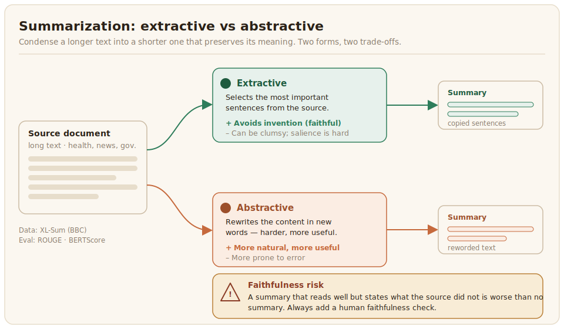

# Summarization

Summarization condenses a longer text into a shorter one that preserves its meaning. It comes in two forms. Extractive summarization selects the most important sentences from the source, while abstractive summarization rewrites the content in new words, which is harder and more useful but also more prone to error. For African languages summarization is valuable because it makes long documents in health, news, and government accessible quickly, and it is difficult for the same reason all generation is: scarce training data and morphologically rich languages that defeat simple methods.



## What the data looks like

Summarization needs documents paired with reference summaries. The most widely used multilingual resource is XL-Sum, built from BBC articles and their professionally written summaries, which covers a number of African languages including Amharic, Hausa, Igbo, Kirundi, Oromo, Nigerian Pidgin, Somali, Swahili, Tigrinya, and Yorùbá ([Hasan et al., 2021](../references.md#xlsum-2021)). Beyond it, summarization data for African languages is sparse, so most projects create their own by pairing source documents with summaries written by native speakers. The same care applies as in machine translation: prefer document-level material from a domain that matters, and watch for source documents that are themselves machine-translated.

A summarization record pairs the source document with one or more reference summaries. Keeping it as JSON, one object per line, keeps long documents and their summaries together with provenance:

```json
{
  "document": "Gwamnatin tarayya ta sanar da sabon shirin samar da ruwan sha a yankunan karkara...",
  "summary": "Gwamnati ta kaddamar da shirin ruwan sha na karkara.",
  "language": "hau_Latn",
  "source": "XL-Sum / BBC Hausa",
  "license": "CC BY-NC-SA 4.0"
}
```

Recording more than one reference summary where you can afford it is worth the cost: a single reference unfairly penalizes a correct summary that happens to phrase things differently, a problem made worse by the morphological richness discussed below.

## Distinctive challenges

The central risk in summarization is faithfulness. An abstractive summary that reads well but states something the source did not is worse than no summary at all, and that risk is higher in low-resource languages where the model's grip on meaning is weaker. Extractive methods avoid invention but can be clumsy in morphologically rich languages where sentence boundaries and salience are harder to detect. Whichever form you target, a human check for whether the summary is faithful to the source is essential.

## Evaluation

The standard automatic metric, [ROUGE](https://pypi.org/project/rouge-score/), measures the overlap of words and short sequences between the generated summary and a reference. It is convenient but unreliable for African languages, because morphological richness means a correct summary can use different surface forms and still be marked wrong, the same weakness that affects BLEU in translation. Embedding-based metrics such as [BERTScore](https://github.com/Tiiiger/bert_score) capture meaning better, and a dedicated faithfulness or factuality check, whether automatic or human, catches the inventions that overlap metrics miss. As everywhere in generation, native-speaker human evaluation remains the ground truth.

In practice you compute both, read ROUGE as a rough signal, and lean on BERTScore with a multilingual model that has seen the target language:

```python
# pip install rouge-score bert-score
from rouge_score import rouge_scorer
from bert_score import score as bert_score

predictions = ["Gwamnati ta kaddamar da shirin ruwan sha na karkara."]
references = ["An kaddamar da sabon shirin ruwan sha a karkara."]

# ROUGE: surface overlap. Treat as a weak internal signal only.
scorer = rouge_scorer.RougeScorer(["rouge1", "rougeL"], use_stemmer=False)
for pred, ref in zip(predictions, references):
    r = scorer.score(ref, pred)
    print(f"ROUGE-1 F: {r['rouge1'].fmeasure:.3f}  ROUGE-L F: {r['rougeL'].fmeasure:.3f}")

# BERTScore: meaning overlap. Use a multilingual model that covers the language.
P, R, F1 = bert_score(predictions, references, lang="ha",
                      model_type="bert-base-multilingual-cased")
print(f"BERTScore F1: {F1.mean().item():.3f}")
```

Two cautions specific to African languages. ROUGE uses no stemmer here, because the stemmers shipped with these tools target English and mangle agglutinative or richly inflected words. And BERTScore is only as good as its underlying model: if the language is absent from the multilingual model, the score is meaningless, so verify coverage before trusting it, and fall back to human evaluation when no model covers the language.
