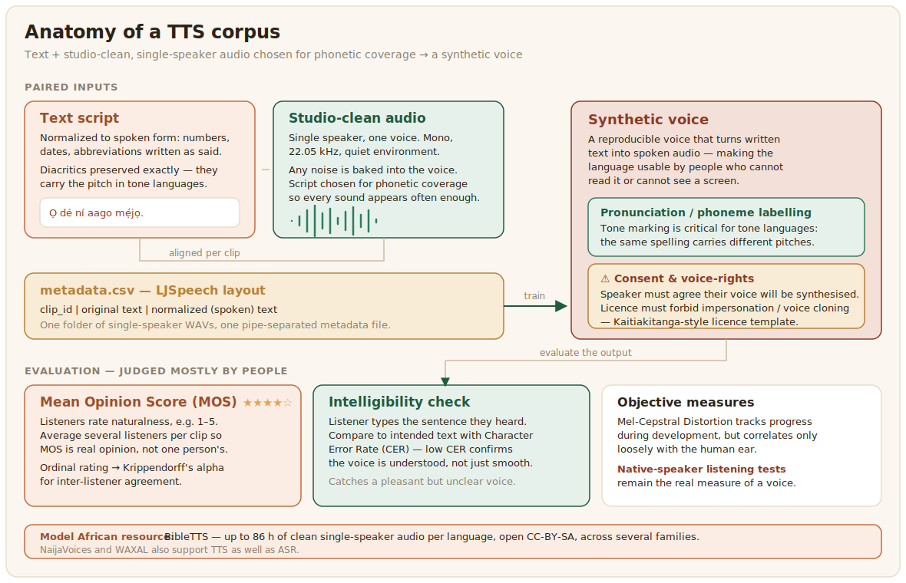

# Text-to-Speech

Text-to-speech (TTS) is the reverse of ASR: it turns written text into spoken audio. A good TTS voice makes a language usable by people who cannot read it or cannot see a screen, which matters enormously where literacy and connectivity vary widely. TTS is data-hungry in a particular way, because it needs not just a lot of speech but very clean, consistent speech from voices you have the right to reproduce.



## What the data looks like

A TTS corpus is text paired with high-quality recordings of that text being read, usually by a single speaker for a single voice. Two things set it apart from ASR data. The recordings must be studio-clean, since any background noise or inconsistency is baked into the synthetic voice, and the script must be chosen for phonetic coverage, so that every sound and sound-combination in the language appears often enough for the model to learn it. BibleTTS is the model African resource here, offering up to 86 hours of clean single-speaker audio per language under an open CC-BY-SA licence across several language families ([Meyer et al., 2022](../references.md#bibletts-2022)), and broader corpora such as NaijaVoices and WAXAL support TTS as well as ASR ([Emezue et al., 2025](../references.md#emezue-2025); [WAXAL, 2026](../references.md#waxal-2026)).

The common layout, popularised by LJSpeech, is a folder of single-speaker WAV files and one metadata file linking each clip to its text. A pipe-separated file holds the original text and a normalized, spoken-form version side by side, because numbers, dates, and abbreviations must be written as they are actually said before the model ever sees them:

```text
# metadata.csv  —  clip_id | original text | normalized (spoken) text
yor_0001|Ó dé ní aago 8.|Ó dé ní aago mẹ́jọ.
yor_0002|Ẹ kú àárọ̀, ẹ jọ̀wọ́ jókòó.|Ẹ kú àárọ̀, ẹ jọ̀wọ́ jókòó.
```

Keep the audio itself consistent: a single speaker, one sample rate (22.05 kHz is common for TTS), mono, and a quiet recording environment. The diacritics in the example are not decoration. For a tone language they carry the pitch, so the metadata must preserve them exactly, since this text is what teaches the voice how to sound.

## Distinctive annotation and consent

Beyond transcription, TTS data often needs pronunciation or phoneme labelling, especially for tone languages where the same spelling carries different pitches and meanings, and getting tone right is the difference between a natural voice and an unintelligible one. The consent question is also sharper here than anywhere else in the playbook, because a TTS dataset reproduces a specific person's voice. A speaker must understand and agree that their voice will be synthesised, and the licence should constrain misuse such as impersonation or voice cloning. The Kaitiakitanga model from the [data governance](../data-governance/index.md) chapter, which forbids harmful uses outright, is a good template for voice data.

## Evaluation

TTS quality is judged mostly by people. The standard measure is the [Mean Opinion Score (MOS)](https://en.wikipedia.org/wiki/Mean_opinion_score), where listeners rate samples for naturalness, supported by intelligibility tests that check whether listeners can actually understand the output. Objective measures such as Mel-Cepstral Distortion exist and help track progress during development, but they correlate only loosely with what a human ear hears, so native-speaker listening tests remain the real measure of a voice.

Because MOS is collected from listeners, the listening test is an annotation task a labeling tool can run. The config below plays a synthesized clip, asks for a naturalness rating, and runs an intelligibility check by asking the listener to type what they heard, which catches a voice that sounds smooth but is hard to understand:

```xml
<View>
  <Audio name="sample" value="$audio"/>
  <Header value="How natural does this voice sound?"/>
  <Rating name="naturalness" toName="sample" maxRating="5"
          required="true"/>
  <Header value="Type the sentence you heard"/>
  <TextArea name="heard" toName="sample" rows="2" required="true"
            placeholder="Write exactly what you understood"/>
</View>
```

Give the same clips to several listeners so a mean opinion score is an average of real opinions rather than one person's, and check their agreement with the [Data Quality](./data-quality) script. The naturalness rating is ordinal, so Krippendorff's alpha is the right agreement measure. The typed-back sentence gives a second, objective signal: compare it to the intended text with the same Character Error Rate from the [ASR](./asr) page, and a low error rate confirms the voice is not just pleasant but actually intelligible.
