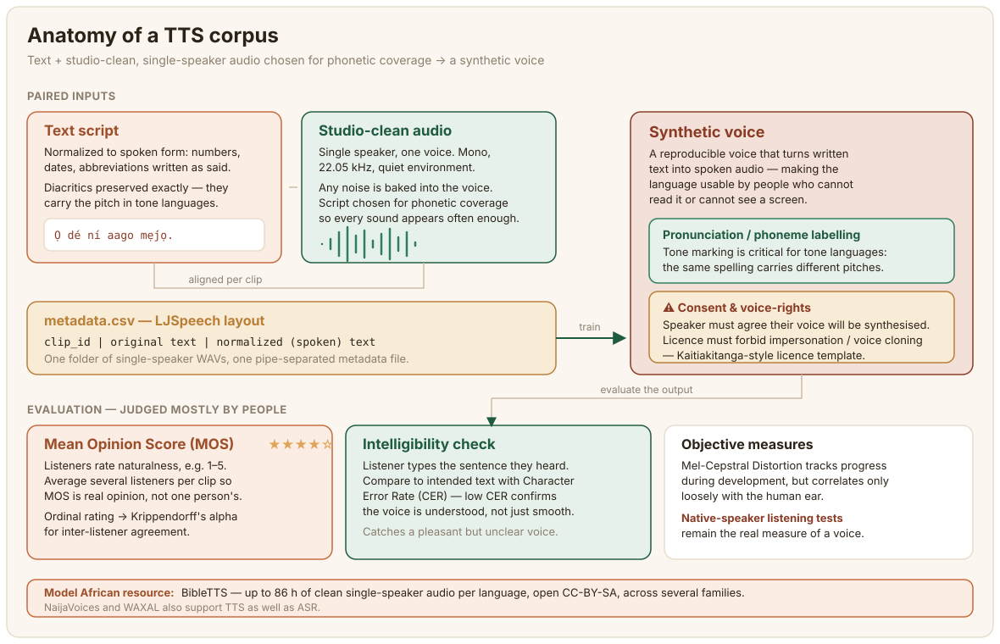

# Text-to-Speech

Text-to-speech (TTS) is the reverse of ASR: it turns written text into spoken audio. A good TTS voice makes a language usable by people who cannot read it or cannot see a screen, which matters enormously where literacy and connectivity vary widely. TTS is data-hungry in a particular way, because it needs not just a lot of speech but very clean, consistent speech from voices you have the right to reproduce. This chapter covers the deeper how-to: the data shape, the recording pipeline, the text preparation, the annotation and consent choices, the quality assurance during collection, and evaluation.

For the higher-level decision — should you build a corpus, fine-tune MMS-TTS, or use a released model — start with the [Before You Start · Text-to-Speech](../before-you-start/tts.mdx) page. The two chapters are complementary: that page decides which path to take, this page details how the chosen path is actually executed.



## What the data looks like

A TTS corpus is text paired with high-quality recordings of that text being read, usually by a single speaker for a single voice. Two things set it apart from ASR data. The recordings must be studio-clean, since any background noise or inconsistency is baked into the synthetic voice, and the script must be chosen for phonetic coverage, so that every sound and sound-combination in the language appears often enough for the model to learn it. BibleTTS is the model African resource here, offering up to 86 hours of clean single-speaker audio per language under an open CC-BY-SA licence across several language families ([Meyer et al., 2022](../references.md#bibletts-2022)), and broader corpora such as NaijaVoices and WAXAL support TTS as well as ASR ([Emezue et al., 2025](../references.md#emezue-2025); [WAXAL, 2026](../references.md#waxal-2026)).

The common layout, popularised by LJSpeech, is a folder of single-speaker WAV files and one metadata file linking each clip to its text. A pipe-separated file holds the original text and a normalized, spoken-form version side by side, because numbers, dates, and abbreviations must be written as they are actually said before the model ever sees them:

```text
# metadata.csv  —  clip_id | original text | normalized (spoken) text
yor_0001|Ó dé ní aago 8.|Ó dé ní aago mẹ́jọ.
yor_0002|Ẹ kú àárọ̀, ẹ jọ̀wọ́ jókòó.|Ẹ kú àárọ̀, ẹ jọ̀wọ́ jókòó.
```

Keep the audio itself consistent: a single speaker, one sample rate (22.05 kHz is common for TTS), mono, and a quiet recording environment. The diacritics in the example are not decoration. For a tone language they carry the pitch, so the metadata must preserve them exactly, since this text is what teaches the voice how to sound.

## Phonetic coverage — what "enough" means per language family

Phonetic coverage is the reason a TTS corpus cannot be assembled from whatever text is convenient. The prompts must contain every phoneme of the target language, and every phoneme in every position (word-initial, medial, word-final) enough times for the model to learn it. What "enough" means depends on the language.

- **Bantu languages** (Kiswahili, Kinyarwanda, isiZulu, Chishona and relatives) have relatively small consonant inventories but rich vowel-length and tone contrasts. Aim for at least twenty-five instances of every phoneme in every position; more is safer for the tone contrasts, which sit on top of the segmental phonemes and need their own coverage.
- **Volta-Niger languages** (Yoruba, Igbo, Ewe, Twi, Fon) carry lexical tone and vowel harmony. Prompts must exercise every tone-vowel combination; a script that covers the segments but not the tone patterns produces a voice that reads words correctly but wrongly.
- **Chadic languages** (Hausa, and its Ajami-written variants) mix tone with implosive and ejective consonants (`ɓ`, `ɗ`, `ƙ`, `ƴ`) that many text sources drop or misspell. Verify prompts against a linguistic reference before recording; typographic hooks are load-bearing.
- **Ethiopic Semitic** (Amharic, Tigrinya) has gemination and pharyngeal or ejective consonants that Latin transliteration mangles. Prompts should be in Ge'ez script from the start; converting from Latin transliterations at read time introduces inconsistency.
- **Nilotic and other tonal languages** (Dholuo, Luganda, Setswana with implosives) — treat as with Volta-Niger: tone-vowel coverage is a separate constraint from segmental coverage.

A phonetic-coverage audit before recording begins is the single cheapest quality-control step. Run each candidate prompt through a phonemiser (a language-specific G2P if you have one, an educated approximation via IPA otherwise), tally per-phoneme frequency, and add prompts to fill gaps. The audit takes days; the alternative is discovering after a hundred hours of recording that half the phonemes are under-represented.

## Choosing the voice

Selecting the speaker is a technical and a political decision, and the two are rarely aligned. A single-voice TTS system produces exactly one voice, and every listener will hear it as "the" way the language sounds. The choice signals which dialect, which register, which speech style, and often which gender is authoritative for the language. Involve the community in the choice; a project team decision here erodes the community's ownership of the resource.

Practical criteria for a first-voice speaker:

- **Native speaker of the target variety** — no one else should be the primary voice. Non-native competence, even at high proficiency, produces a voice the community will not recognise as their own.
- **Vocal consistency across sessions** — the model learns the speaker's voice, and drift in tone, energy, or accent across recording sessions produces an unstable synthetic voice. Some speakers are naturally more consistent than others; audition candidates over multiple short sessions before committing.
- **Prosodic clarity** — clear enunciation, natural sentence-level rhythm, moderate speech rate. Broadcasters, teachers, and voice actors often meet this bar; casual speakers may not.
- **Stamina** — a full TTS recording effort is 20 to 100 hours of studio time spread over months. A speaker who tires quickly or whose voice varies with fatigue changes the effective quality after hour three of each session.
- **Availability for a long project** — retaining the same speaker for the full corpus is cheaper than switching mid-way and re-recording.

If the community's preference is to build a multi-voice corpus (multiple speakers rather than one), the same criteria apply per speaker, plus a design decision about whether the released model produces per-speaker voices or a single averaged voice. Multi-voice TTS is a more research-grade path and needs a proportional data budget.

## Recording pipeline

The recording pipeline is where most quality problems start, and where the cheapest fixes live.

**Studio setup.** A treated small room with a cardioid condenser microphone through a decent audio interface is the working reference. Home recording rooms with sound blankets work; a professional studio is better but not required for TTS quality. What matters is a consistent acoustic environment across every session — moving the microphone, changing the room's absorption, or swapping equipment mid-project all show up in the model.

**Session structure.** Sessions of 60 to 90 minutes with breaks work better than four-hour marathons for both speaker vocal health and consistency. Warm up with a few sacrificial prompts (not used in the corpus) at the start of every session, so the first "real" clips are not the ones where the speaker is still finding their voice. End every session with a check-listen on a random sample of that day's clips.

**Prompt delivery.** The speaker reads from a prompt display — a screen, a tablet, or printed cards — that shows one prompt at a time. Auto-advancing displays that require the speaker to keep pace add stress; speaker-controlled advancement is calmer. Between prompts, wait for silence to end (roughly one second of room tone) before starting the next clip; splicing on speech onset without room tone produces artefacts.

**Take management.** Every prompt gets one clean take. Second takes on the same prompt lose the original's rhythm and are hard to blend; better to re-record the clip in a later session if the first is bad. Log per-clip decisions (kept, rejected, needs re-record) at recording time — post-hoc quality review across a hundred hours of audio is exhausting.

**Quality gate.** At the end of each session, listen back to a random 5% of the day's clips against the prompt text. If clip content matches the prompt, tone is preserved, and there are no environmental artefacts, keep the session. If any fail, understand why before recording continues.

## Text preparation and normalisation

TTS models learn to pronounce whatever is written; garbage in, garbage out is literal here. Text normalisation is the step where an incoming prompt is rewritten so that what the model sees is exactly what should be spoken.

- **Numbers, dates, and times** are written as they are read: "8" becomes "eight" in the metadata's normalised column. Different languages read numbers differently; get a native speaker to verify the normaliser's output before recording.
- **Abbreviations and symbols** (`Dr.`, `Mrs.`, `USD`, `%`) — expand every one. A model that has never seen "percent" spelled out will not know what to say when it sees `%`.
- **Homographs** — words that are spelled the same but pronounced differently (English `read` past vs. present is the canonical example; African languages have their own). Mark the intended pronunciation in the normalised column, often via a phonemic transcription or a language-specific convention.
- **Tone marks** — for tone languages, verify that every prompt in the corpus has correct tone marking before recording. A prompt with dropped diacritics teaches the model a wrong pronunciation that later inference will reproduce.
- **Script switching** — Hausa Ajami vs. Latin, Amharic Ge'ez vs. Latin transliteration, Mandinka Latin vs. N'Ko. Fix the script for the corpus at Step 0; do not mix within a single voice. See the [non-Latin scripts in real UIs](../deployment/non-latin-scripts.md) chapter for the deployment implications.
- **Loanwords and code-mixed content** — real user text mixes English, French, or Arabic terms with the local language. A monolingual TTS corpus produces a model that stumbles on real user input; include a proportion of realistic code-mixed prompts, and mark the switch points explicitly in normalisation.

## Distinctive annotation and consent

Beyond transcription, TTS data often needs pronunciation or phoneme labelling, especially for tone languages where the same spelling carries different pitches and meanings, and getting tone right is the difference between a natural voice and an unintelligible one. The consent question is also sharper here than anywhere else in the playbook, because a TTS dataset reproduces a specific person's voice. A speaker must understand and agree that their voice will be synthesised, and the licence should constrain misuse such as impersonation or voice cloning. The Kaitiakitanga model from the [data governance](../data-governance/index.md) chapter, which forbids harmful uses outright, is a good template for voice data.

The consent conversation for a TTS speaker must specifically cover **voice-cloning risk**: modern TTS models can be adapted from a released voice to say arbitrary content, and once a model is public, that risk cannot be revoked. Frame this explicitly at consent time, in the speaker's own language, and record the acknowledgement as part of the consent artefact. The [legal, consent, and community IP](../legal-consent/index.md) chapter and the [consent form template](../templates/consent-form.md) cover the operational patterns; the [Before You Start · TTS](../before-you-start/tts.mdx) page carries the editorial position.

## Quality assurance during collection

Quality problems caught in the studio cost minutes. The same problems caught during model training cost weeks. Build a per-session review workflow before recording begins.

- **Per-clip listening review** — a reviewer independent of the speaker listens to every kept clip, matches it against the intended prompt text, and flags mismatches (dropped words, misread numbers, tone errors, environmental noise). Random-sample verification catches statistical drift; full listening catches the individual bad clip.
- **Technical audio checks** — automated per-clip loudness normalisation, silence trimming, and clipping detection. A clip that peaks at digital zero is unusable and should be re-recorded, not "fixed" in post.
- **Tone-preservation verification** — for tone languages, a randomly-sampled per-week check with a linguist or trained native speaker confirms that tone patterns match the intended text. Tone drift is the single most subtle failure mode.
- **Speaker-consistency spot check** — every ten hours of recording, compare the first hour and the most recent hour on a matched-prompt basis. Voice drift is normal over long projects; detecting it early lets you either accept it as a stylistic choice or intervene to correct.

## Evaluation

TTS quality is judged mostly by people. The standard measure is the [Mean Opinion Score (MOS)](https://en.wikipedia.org/wiki/Mean_opinion_score), where listeners rate samples for naturalness, supported by intelligibility tests that check whether listeners can actually understand the output. Objective measures such as Mel-Cepstral Distortion exist and help track progress during development, but they correlate only loosely with what a human ear hears, so native-speaker listening tests remain the real measure of a voice.

Because MOS is collected from listeners, the listening test is an annotation task a labeling tool can run. The config below plays a synthesized clip, asks for a naturalness rating, and runs an intelligibility check by asking the listener to type what they heard, which catches a voice that sounds smooth but is hard to understand:

```xml
<View>
  <Audio name="sample" value="$audio"/>
  <Header value="How natural does this voice sound?"/>
  <Rating name="naturalness" toName="sample" maxRating="5"
          required="true"/>
  <Header value="Type the sentence you heard"/>
  <TextArea name="heard" toName="sample" rows="2" required="true"
            placeholder="Write exactly what you understood"/>
</View>
```

Give the same clips to several listeners so a mean opinion score is an average of real opinions rather than one person's, and check their agreement with the [Data Quality](../data-quality/index.md) script. The naturalness rating is ordinal, so Krippendorff's alpha is the right agreement measure. The typed-back sentence gives a second, objective signal: compare it to the intended text with the same Character Error Rate from the [ASR](../asr/index.md) page, and a low error rate confirms the voice is not just pleasant but actually intelligible.

Alongside MOS, run one or more of the automatic proxies during development, remembering that they are proxies, not verdicts:

- **[UTMOS](https://arxiv.org/abs/2204.02152)** and **[NISQA](https://arxiv.org/abs/2104.09494)** predict naturalness MOS. Useful for tracking training progress; not a substitute for human MOS at release.
- **CER round-trip** — synthesise a held-out test set, transcribe with an ASR (per the [ASR chapter](../asr/index.md)), compute CER against the reference text. A low CER means the voice is intelligible enough for an ASR to read it; a rising CER during training means intelligibility is degrading.
- **Speaker-similarity metrics** — for projects that clone a specific voice, or projects that need to verify a model does NOT clone one, ECAPA-TDNN or x-vector cosine similarity between reference and synthesised audio provides a signal on voice identity.

## Deployment realities

For a language covered by [Meta MMS-TTS](https://huggingface.co/facebook/mms-tts), the out-of-the-box model is often good enough for a first deployment. Measure MOS with native listeners on your target text style — not on Common Voice sentences — before committing to a full fine-tune. When MMS-TTS quality is inadequate, VITS or XTTS fine-tuning on 5–20 hours of studio-quality single-speaker audio is the practical next step; see [Before You Start · TTS](../before-you-start/tts.mdx) for the model-selection tree.

For deployment on constrained hardware (phones, low-power edge servers), quantisation matters as much as it does for other modalities. The [edge devices](../deployment/edge-devices.md) chapter covers the phone-tier map, runtime choices, and the model-size budgets you have to design against. Voice-note replies over WhatsApp — an increasingly common African deployment surface — are covered in the [SMS, USSD, and WhatsApp](../deployment/sms-ussd-whatsapp.md) chapter.

## What breaks — common failure modes

- **Tone-flattened voice.** The model reads the segmental phonemes correctly but drops the tone contrasts. Cause: training data has inconsistent tone marking. Fix: audit tone marks before recording, not after.
- **Voice drift across a corpus.** The synthetic voice sounds slightly different from clip to clip. Cause: speaker consistency drifted during recording. Fix: per-week spot check during collection, not a single post-hoc review.
- **Robotic prosody on real user input.** The voice sounds natural on prompts similar to the training script but stilted on real user text. Cause: training script did not reflect real user register (news read-aloud vs. conversational). Fix: include a proportion of naturalistic prompts in the training set.
- **Fine on training language, breaks on code-mixed input.** Cause: monolingual corpus. Fix: include realistic code-mixed prompts in training, with switch points marked in normalisation.
- **Right voice, wrong pronunciation.** The model reads words differently from how a native speaker would, especially for named entities. Cause: no pronunciation lexicon; the model has to guess. Fix: build a lexicon of high-frequency proper nouns and enforce their pronunciation via the normalisation step.
- **Post-quantisation collapse.** The model sounds fine at full precision but degrades sharply after quantisation for on-device deployment. Cause: quantisation was an afterthought rather than a design constraint. Fix: measure at the deployment precision from the start; see the [compute-poor training](../compute-poor/index.md) chapter's discussion of quantisation as a deployment lever.
