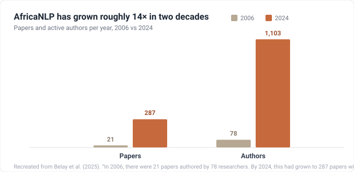
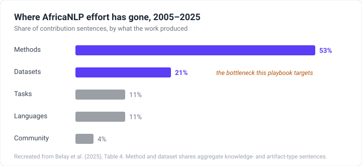

# Gabatarwa {#introduction}

:::tip[Ba da Gudummuwa]
Wannan jagorar (playbook) budaddiyar manhaja ce (open source) kuma mallakar al'umma ce. Ba sai ka rubuta cikakken babi ba kafin ka taimaka. Gyara kuskure, fassara shafi, ko raba abin da ya yi aiki a wani aikin gaske duk suna da muhimmanci. Duba [**Ba da Gudummuwa**](/introduction/how-to-contribute).
:::

> Harsashi shi ne hanyar mallake gangar jiki. Harshe kuma shi ne hanyar mallake ruhi.
>
> Ngũgĩ wa Thiong'o, *Decolonising the Mind: The Politics of Language in African Literature* (1986)

Afirka tana ɗauke da kusan kashi ɗaya bisa uku na yarukan duniya masu rai: kusan 2,140 daga cikin kusan 7,160 da ake magana da su a doron ƙasa ([Ethnologue, 2024](/references#ethnologue-2024)). Yawancinsu sun kasance a waje da tsarin da a yanzu ke sauya yadda sauran sassan duniya ke karatu, rubutu, bincike, fassara, da kuma magana. Hatta waɗanda suka fi samun tallafi, kamar Swahili, Hausa da Amharic, suna da nisa sosai a baya idan aka kwatanta su da yaruka masu ɗimbin kayan aiki (high-resource languages). Idan ƙirar harshe (language model) ta ɓata Yorùbá, Chichewa, ko Wolof, yawanci ba ƙirar ba ce matsalar, a'a bayanan (data) ne. Rubutu da maganganun da waɗannan tsare-tsare ke koya daga gare su kusan ba su wanzu a yanayin da za a iya amfani da su ba.

[Joshi et al. (2020)](/references#joshi-2020) sun rarraba yarukan duniya zuwa matakai shida bisa ga yawan kayan aikin da suke da su. Matakin ƙasa, wato *waɗanda aka bari a baya* (left-behinds), waɗanda a zahiri ba su da bayanan da aka yi wa lakabi (labelled data) kuma ba su da kyakkyawan fata na samun kulawa daga hanyoyin da ake da su a yanzu, shi ne ya ƙunshi mafi yawan yaruka, kuma yarukan Afirka sun cika a cikinsa. Yawancinsu ba su da rumbun bayanai da aka yi wa lakabi (annotated corpus), ba su da ma'auni (benchmark), ba su da kayan aiki. Da yawa suna da masu magana da su da suka kai dubunnan miliyoyi. Abin da suka rasa shi ne bayanai (data), saboda kusan babu wanda ya gina su. Wannan yanayi har yanzu yana nan, kodayake a yanzu fannin yana kallon ƙarancin kayan aiki (low-resource) a matsayin abu mai fuskoki da yawa: batun kayan aiki, masu magana da harshen, tallafin kuɗi, da goyon bayan hukumomi daidai da ɗanyun bayanai (raw data), ba tare da wata guda ɗaya da aka amince da ita ba a matsayin ma'ana ([Ranathunga & de Silva, 2022](/references#ranathunga-desilva-2022); [Nigatu et al., 2024](/references#nigatu-2024)).


## Kwashe bayanai daga intanet (scraping) ba zai gyara wannan ba {#scraping-will-not-fix-this}

Idan harshe ba shi da bayanai, abin da ke zuwa a zuciya shi ne a je a kwashe (scrape) ƙarin bayanansa: a binciki wani babban yanki na intanet (web) tare da sa ran cewa za a samu isassun bayanai. Ga yarukan Afirka, wannan tunanin ba ya aiki.

Intanet ba ta ƙunshi rubutun yarukan Afirka da yawa ba, kuma abin da ta ƙunsa kaɗan ne kuma cike yake da kurakurai (noisy). Lokacin da [Kreutzer et al. (2022)](/references#kreutzer-2022) suka binciki manyan bayanan yaruka da yawa da aka kwaso (multilingual crawls) waɗanda kowa ke amfani da su wajen horarwa, sun gano cewa ga yawancin yaruka masu ƙarancin kayan aiki, wani babban kaso na bayanan an yi musu lakabi ba daidai ba, an fassara su da na'ura, ko kuma ba harshe ba ne kwata-kwata. A ƙarshe, inganci yana durƙushewa tare da yawa.

Hanya ɗaya tilo da ta tabbata na samun bayanai masu inganci ga yarukan Afirka ita ce gina su tare da mutanen da ke magana da su, mutanen da suka san kalmomin, ƙa'idojin rubutu (grammar), karin magana, da kuma al'ada. Ɗaya daga cikin manyan matsaloli a AfricaNLP ita ce mutanen da ke magana da waɗannan yarukan ba su ne ke gina bayanan ba. Mutanen da ke gina su sau da yawa ba za su iya gane abin da ke daidai ba, abin da ke ɓata rai, ko abin da ya ɓace. Ba su san abin da ke da muhimmanci ga al'ummomin da ke da harshen ba, ko yadda za su kiyaye bayanan da suka tattara daga haifar da illa.

Wannan gibin yana da ainihin sakamako marar kyau. Bayanan da aka gina ba tare da masu magana da harshen ba na iya zama kamar masu kyau alhali suna cike da kurakurai a ɓoye, kuma duk wata ƙira (model) da aka horar da ita a kansu tana gādon kowane kuskure. Irin waɗannan kurakurai suna yaɗuwa a cikin sakamakon bincike, fassarori, da kayan aikin yau da kullun waɗanda miliyoyin mutane suka fara dogara da su. Samun bayanan daidai shi ke tantance ko an yi wa harshe kyakkyawan aiki, ko an yi masa mummunan aiki, ko kuma an cire shi gaba ɗaya daga waɗannan kayan aikin.

Wannan jagorar (playbook) tana bayani ne kan yadda za a gyara wannan matsalar. Wannan jagora ce a aikace, mai ɗauke da ra'ayoyi, da mataki-mataki don gina rumbun bayanai (datasets) masu inganci ga yarukan Afirka, wanda aka samo daga ƙwarewar kai tsaye ta mutanen da ke magana da kuma fahimtar su. Mutanen da suka san yarukan ne suka gina wannan jagorar, don mutanen da ke son gina musu rumbun bayanai. Tana bayani ne kan yadda za a yi shi daidai, da kuma yadda za a yi shi cikin aminci.

## Fannin yana haɓaka, bayanan ba su tafiya daidai da shi {#the-field-is-growing-the-data-is-not-keeping-up}

A cikin shekaru ashirin da suka gabata, AfricaNLP ya haɓaka daga wani ƙaramin abin sha'awa zuwa wani kafaffen fanni. Sakamakon bincike ya ƙaru fiye da ninki goma, daga kusan takardu 20 a shekara a 2006 zuwa kusan 300 a 2024 ([Belay et al., 2025](/references#belay-2025)).



Amma yawan takardu bai nufin yawan bayanai ba. Fiye da rabin wannan aikin yana gabatar da sababbin hanyoyi ne (methods), yayin da kusan ɗaya kawai cikin biyar na gudummuwar ke gabatar da sabon rumbun bayanai ([Belay et al., 2025](/references#belay-2025)). Muna ƙara ƙwarewa wajen gina ƙira (models) da sauri fiye da yadda muke gina bayanan da suke koya daga gare su.



Hanyoyi da rumbun bayanai ba a yin su ta hanya ɗaya. Hanyar (method) sau da yawa ana iya sake amfani da ita a kan yaruka daban-daban; rumbun bayanai (dataset) dole ne a gina shi ga kowane yare, tun daga farko, ta mutanen da ke magana da shi. Wannan yana nufin ɗaukar masu yin lakabi (annotators), rubuta ƙa'idoji, gudanar da kula da inganci, da samun amincewa. Aiki ne mai jinkiri, marar ɗaukar hankali, kuma da wuya a ba shi tallafin kuɗi, musamman ga yarukan Afirka.

Wannan jagorar tana nan don sauƙaƙa wannan aikin. Tana bi ta kowane mataki na gina rumbun bayanai: yanke shawarar abin da za a tattara, tsara yadda za a yi lakabi (annotation), duba inganci, rubuta bayanai (documenting), da kuma fitarwa. An rubuta ta ne don ainihin yanayin NLP na yarukan Afirka: ƙarancin bayanai, ƙungiyoyi masu magana da yaruka da yawa, ƙarancin tallafin kuɗi, da al'ummomin da ya kamata su ci gaba da zama masu mallakar abin da suka taimaka wajen ƙirƙira.

## Me ya sa muka rubuta wannan jagorar {#why-we-wrote-this-playbook}

Kusan kowane jagora na gina rumbun bayanai a ɓoye yana ɗauka cewa ana amfani da Turanci ne, akwai isasshen kasafin kuɗi, kuma matsala ce da wani ya riga ya warware ta a baya. Kaɗan daga cikin wannan ke aiki lokacin da kake fara gina rumbun bayanai (corpus) ga harshen da ba shi da kayan aiki a baya, ƙungiyar masu aikin sa-kai, da kuma shawarwarin da za a yanke waɗanda littattafai ba su taɓa tattaunawa a kansu ba.

AfriPlaybook ita ce jagorar da muke fatan da ma muna da ita. Da yawa daga cikinmu sun koyi gina rumbun bayanai ga yarukan Afirka ta hanya mai wahala, ta hanyar gwaji da kuskure, tare da ƙarancin abin da aka rubuta a ƙasa da kuma mutane kaɗan da za a tambaya. Wannan wani ɓangare ne na dalilin da ya sa rumbun bayanai suka yi baya sosai idan aka kwatanta da hanyoyi (methods). Wannan jagorar tana tattara abin da muka koya domin ƙungiya ta gaba ta fara da wuri, ta guje wa kurakuran da muka yi, kuma ta gina bayanan da duniya za ta iya amincewa da su kuma ta sake amfani da su.

Jagorar za ta ci gaba da haɓaka yayin da al'umma ke raba abin da ta koya. Yayin da muke ƙara haɗa ƙwarewarmu, zai zama da sauƙi a gina bayanai, kuma da wuri rumbun bayanai za su iya cimma hanyoyi (methods).

## An gina a buɗe {#built-in-the-open}

Wannan jagorar budaddiyar manhaja ce (open source), wacce al'ummar Waraka, Masakhane, da masu binciken AfricaNLP ke kula da ita. Ba don masu bincike kawai ba ce. Don kowa ne da ke gina rumbun bayanai ga yarukan Afirka: masu aikin sa-kai, ɗalibai, masu tsara al'umma, da ƙwararru baki ɗaya. Mutanen da ke gina rumbun bayanai su suka fi sanin abin da jagora irin wannan ya kamata ta faɗa, don haka ingancinta ya dogara ne da mutanen da ke ba da gudummuwa a cikinta. Akwai hanyoyi da yawa na taimakawa:

- **Rubuta** babi ko sashe da zai cike wani gurbi.
- **Duba** babukan da ke akwai: gyara kuskure, ƙarfafa wani bayani, ƙara wata majiya (reference).
- **Raba wani nazari (case study)** daga aikin gaske, gami da abin da ya faru ba daidai ba.
- **Buɗe tattaunawa** lokacin da ba ka yarda da wata hanya ba. Rashin yarda yana sa jagorar ta fi kyau.

Fara da [jagorar ba da gudummuwa](https://github.com/warakacommunity/playbook/blob/main/README.md#ways-to-contribute), kawo wani tunani a [GitHub Discussions](https://github.com/warakacommunity/playbook/discussions), ko ka shiga tare da mu a [Discord](https://discord.gg/ChNPHV2PPS). Idan kana gina rumbun bayanai ga yarukan Afirka, ko kana son koyon yadda ake yi, tun riga ka zama ɗaya daga cikin waɗanda aka yi wannan don su. Zo mu gina ta tare.

---

## Yadda za a kawo nassoshi (cite) na wannan jagorar {#how-to-cite-this-playbook}

Idan AfriPlaybook ta taimaka a bincikenka, koyarwarka, ko aikinka, da fatan za ka kawo nassoshinta.

**BibTeX:**

```bibtex
@misc{waraka2026playbook,
  author       = {{Waraka Community}},
  title        = {AfriPlaybook: A Practical Guide to Building High-Quality Datasets for African Languages},
  year         = {2026},
  publisher    = {Waraka Community},
  url          = {https://afriplaybook.waraka.org/},
  note         = {Open-source community resource}
}
```

**Rubutu zalla (Tsarin APA):**

> Waraka Community. (2026). *AfriPlaybook: A Practical Guide to Building High-Quality Datasets for African Languages*. [https://afriplaybook.waraka.org/](https://afriplaybook.waraka.org/)

Don wasu tsare-tsare (MLA, Chicago, da sauransu) da kuma [`CITATION.cff`](https://github.com/warakacommunity/playbook/blob/main/CITATION.cff) da na'ura za ta iya karantawa, duba shafin [/cite](/cite).

Idan ka yi nuni ga wani takamaiman babi, da fatan za ka haɗa da taken babin da kuma adireshinsa na intanet (URL).
