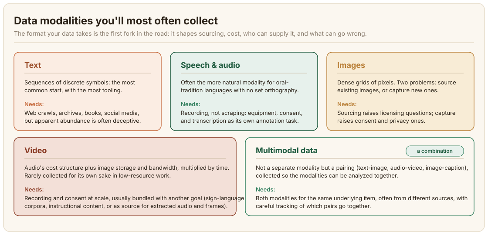

# Sigogin Bayanai {#data-modalities}

Koyi abin da sigar bayanai (data modality) ke nufi, dalilin da ya sa take zama mataki na farko a kowane tsarin tattarawa, da kuma yadda take tasiri kan farashi, samo asali, da kayan aiki tun kafin wani ya rubuta ƙa'idar lakabi (annotation).

## Menene siga (modality) {#what-a-modality-is}

**Sigar bayanai** (data modality) ita ce tsarin da wani bayani ke ɗauka: rubutu, hoto, sauti, bidiyo, ko wani tsari da ya haɗa waɗannan. Kowace siga tana ɗaukar bayanai ta hanya daban kuma tana buƙatar kayan aiki daban-daban don ɗauka, adanawa, da sarrafa ta. Jumla da hoto suna iya bayyana zane ɗaya, amma ɗayan jerin alamomi ne daban-daban yayin da ɗayan kuma tsari ne mai yawa na ƙwayoyin hoto (pixel values); babu wani abu game da yadda kake tattarawa, adanawa, ko tantance ɗaya da zai yi aiki kai tsaye ga ɗayan.

Wannan yana da muhimmanci fiye da yadda ake tsammani. Yawancin zaɓuɓɓuka masu wahala wajen ƙirƙirar ma'ajin bayanai (daga inda bayanan suka fito, nawa ne farashinsu, waye zai iya yi musu lakabi, me zai iya faruwa ba daidai ba) suna zuwa ne bayan yanke shawara kan siga, ba shawarar ƙirar kwamfuta (modeling) ba. Aikin gano ra'ayi (sentiment) na harsuna da yawa wanda ya yanke shawarar ƙara ɓangaren magana ba "ƙara wani fasali" yake yi ba. Yana fara wani sabon aikin tattarawa ne gaba ɗaya, wanda sau da yawa yake da nasa kasafin kuɗin, tambayoyinsa na doka, da kuma nasa rukunin ƙwararrun masu bayar da gudummawa.

:::note Iyakar wannan sashe
Wannan shafin yana duba siga a matakin **tattarawa**: menene kowace siga kuma me yasa take canza inda zaka je neman bayanai, waye zai iya samar da su, da kuma nawa ne farashinsu. Tsara ayyukan lakabi da tsarin lakabi don wata siga (akwatunan kewaye, ƙa'idodin fassara sauti zuwa rubutu, rabe-raben motsin rai) an tattauna su a gaba, a cikin sassan siga: [Rubutu](/sections/text), [Magana](/sections/speech), [Gani](/sections/vision) da [Siga Daban-daban](/sections/multimodal).
:::

## Sigogin da zaka fi yawan tattarawa {#the-modalities-youll-most-often-collect}

### Rubutu {#text}
Wurin farawa mafi yawa, kuma wanda ke da mafi yawan kayan aikin da ke akwai: kwashe bayanan intanet (web crawls), rumbun adana bayanan gwamnati, littattafai, kafofin sada zumunta. Duk da haka, ga yawancin harsunan Afirka, rubutu shi ne sigar da yawan da ake gani yake fi yaudara. [Joshi et al. (2020)](https://aclanthology.org/2020.acl-main.560/) da [Kreutzer et al. (2022)](https://aclanthology.org/2022.tacl-1.4/), waɗanda aka tattauna a [Gabatarwa](/introduction), sun gano cewa babban kaso na abin da ya yi kama da rubutun harshen Afirka a intanet an yi masa lakabi ba daidai ba, an fassara shi da inji, ko kuma ba ainihin harshen da ake buƙata ba ne gaba ɗaya. Rubutu "yana nan," a ma'anar cewa zaka iya samun fayiloli da ke ɗauke da shi; ko yana nan a tsarin da ya dace a yi horo da shi wata tambaya ce daban, mai wuyar gaske.

### Magana da sauti {#speech-and-audio}
Sauti sau da yawa shi ne siga *mafi* dacewa ga yawancin harsunan Afirka, waɗanda ke ɗauke da al'adun baka na ƙarni da yawa kuma, a wasu lokuta, ba su da daidaitaccen tsarin rubutu da ake amfani da shi sosai. Tattara shi yadda ya kamata yawanci yana nufin ɗaukar sauti, ba kwashewa (scraping) ba: rumbun adana bayanan rediyo, kamfen ɗin ɗaukar sauti na al'umma, tattara bayanai ta wayar tarho, ko haɗin gwiwa da masu watsa shirye-shirye. Yana da tsada a kowace awa fiye da rubutu a kowace kalma, saboda ɗaukar sauti yana buƙatar kayan aiki da amincewa, da kuma saboda mayar da sauti zuwa rubutu (transcription) a kansa aiki ne na musamman na lakabi.

### Hotuna {#images}
Bayanan hoto sun rabu zuwa matsalolin tattarawa guda biyu daban-daban dangane da ko kana samo hotunan da ke akwai ne (rumbun adana kayan tarihi, tarin hotunan jama'a, hotunan tauraron ɗan adam) ko kuma ɗaukar sababbi (kayan kyamara, kamfen ɗin hotunan wayar hannu). Na farkon yana kawo tambayoyi kan lasisi da sake rarrabawa; na biyun yana kawo tambayoyi kan amincewa da sirri, musamman inda fuskoki ko wuraren da za a iya ganewa suke ciki.

### Bidiyo {#video}
Yana haɗa tsarin farashin sauti (ɗauka, amincewa) da farashin adanawa da intanet (bandwidth) na hotuna, ninka shi da lokaci. Ba kasafai ake tattara bidiyo don kansa ba a aikin harsunan da ba su da wadatattun bayanai (low-resource-language); yawanci yana zuwa ne a haɗe da wata manufa: ma'ajin bayanan yaren kurame, abubuwan koyarwa, ko a matsayin asalin abin da daga baya ake cire sauti da hotuna daga ciki.

### Bayanai masu siga daban-daban (Multimodal data) {#multimodal-data}
A zahiri wannan ba wata siga bace mai zaman kanta amma *haɗin gwiwa* ne: rubutu-da-hoto, sauti-da-bidiyo, ko hoto-da-rubutun-bayani (image-caption) da aka haɗa, waɗanda aka tattara domin a iya nazarin sigogin tare ko a kwatanta su da juna. Matsalar tattarawa a nan tana ƙaruwa: kana buƙatar duka sigogin biyu su kasance don abu ɗaya, sau da yawa daga majiyoyi daban-daban, kuma kana buƙatar lura da waɗanne ne suka dace da juna. [Nazarin misali](./case-study-multimodal-data-collection) da ke gaba a cikin wannan babi yana bayyana ainihin wannan matsalar don ma'ajin bayanan hoto-rubutun-bayani-motsin-rai na harsuna 28.

## Me yasa wannan shawarar take zuwa da farko {#why-this-decision-comes-first}

Kafin tsayawa kan majiyoyi ko hanyoyi (sassa biyu na gaba), yana da kyau ka amsa, a rubuce, don aikin ka:

- **Wace siga (ko sigogi) aikin yake buƙata a zahiri?** Kada ka koma ga rubutu kai tsaye saboda an fi saninsa; aikin gano ra'ayi (sentiment) kan harshen da ya fi ƙarfi a al'adar baka zai iya yin kyau idan aka fara daga sauti.
- **Shin sigar tana nan a tsarin da za a iya amfani da ita ga harshen(nun) da kake buƙata gaba ɗaya**, ko kuwa "tattarawa" tana nufin "ƙirƙira" ne a zahiri: ɗaukar sauti ko rubuta abubuwan da ba su kasance a ko'ina ba tukunna?
- **Waye zai iya samar da wannan sigar?** Wani lokaci mutanen da ba su jin harshen sosai za su iya samo rubutu (mai kwashe bayanai ba ya buƙatar karanta Hausa don sauke shafin intanet na Hausa); tattara sauti da bidiyo kusan koyaushe yana buƙatar masu jin asalin harshen a cikin ɗakin ko a kan kiran.
- **Yaya gazawa take a wannan sigar?** Ga rubutu, a ɓoye take: fayil ɗin da aka yi wa lakabi ba daidai ba ko wanda inji ya fassara yana kama da ainihin bayanai har sai wani ya duba. Ga sauti, gazawa sau da yawa a bayyana take kuma ana iya ganinta (ƙarancin ingancin ɗaukar sauti, kuskuren karin harshe) amma ta fi wuyar gyarawa bayan an riga an yi.

Idan ka yanke shawarar siga daidai, sauran wannan babin (majiyoyi, kwashe bayanai, APIs) zai zama jerin zaɓuɓɓuka. Idan ka yi kuskure, babu wani kyakkyawan kayan aiki a gaba da zai gyara tsarin tattarawa da aka gina kan nau'in bayanan da ba su dace ba.
