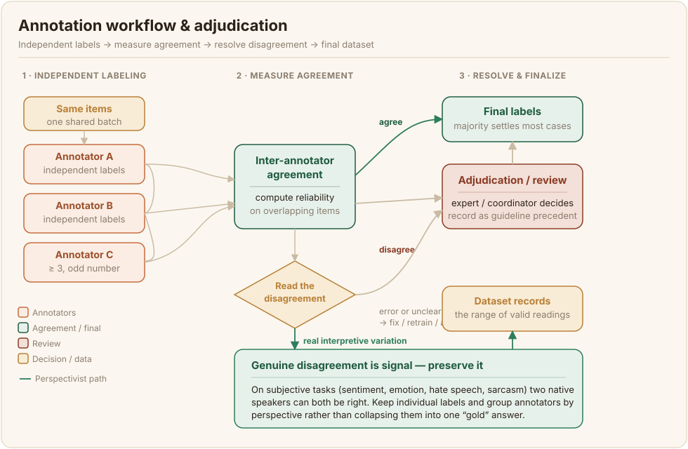

# Tsarin Aiki da Yanke Hukunci {#workflow-and-adjudication}

Da zaran an tsara aikin kuma an horar da masu sanya lakabi (annotators), tsarin aiki (workflow) ne zai yanke shawarar yadda ake samar da lakabi (labels), bincika su, da kuma kammala su. Muhimman tambayoyin su ne mutum nawa ne za su sanya lakabi a kowane abu, yadda ake raba aikin, da kuma abin da ke faruwa idan sun sami saɓani.

## Yi amfani da masu sanya lakabi da yawa a kowane abu {#use-multiple-annotators-per-item}

Lakabin da mutum ɗaya ya sanya ra'ayi ne guda ɗaya kawai, kuma ba za ka iya rarrabe tsakanin tabbataccen daidai da tabbataccen kuskure ba. Raba kowane abu ga masu sanya lakabi da yawa yana ba ka damar auna inganci da warware kurakurai. Al'adar da aka saba da ita ga rumbun bayanai (datasets) na harsunan Afirka ita ce aƙalla masu sanya lakabi uku a kowane abu, tare da lamba mara (odd number) domin rinjaye mai sauƙi ya iya warware mafi yawan matsaloli. Rumbun bayanan sunaye na Masakhane sun yi amfani da masu jin yaren asali guda uku a kowane harshe a ƙarƙashin mai gudanarwa, wanda ya isa a gano kurakuran mutum ɗaya yayin da yake kasancewa mai sauƙin kuɗi ga ƙungiyar masu aikin sa-kai ([Adelani et al., 2022](/references#adelani-2022)). Ƙara yawan masu sanya lakabi yana ƙara inganci da tsada a lokaci guda, don haka samun adadin da ya dace shawara ce ta kasafin kuɗi kamar yadda take shawara ce ta ƙididdiga.

## Raba aiki tare da gangancin maimaitawa (deliberate redundancy) {#assign-work-with-deliberate-redundancy}

Tsara da gangan yadda abubuwa za su shiga juna (overlap) tsakanin masu sanya lakabi. Wani ɗan shiga juna yana da muhimmanci, saboda abubuwan da mutum fiye da ɗaya ya sanya wa lakabi su ne suke ba ka damar lissafa jituwa (agreement) da gano masu sanya lakabi da suka kauce hanya. Haɗa wasu ƙananan amintattun abubuwa na "zinare" (gold) waɗanda aka riga aka sanya wa lakabi a cikin aikin, ba tare da an nuna su ba, yana ba da damar ci gaba da lura da ko kowane mai sanya lakabi yana ci gaba da bin ƙa'ida (guideline) yadda ya kamata. Tsara rabon aikin ta yadda kowane abu zai sami adadin lakabi masu zaman kansu da ake buƙata kuma ta yadda babu wani mai sanya lakabi da zai duba aikin kansa, tunda duba aikin kai yana ɓoye ainihin kurakuran da duba aikin ke ƙoƙarin ganowa.

## Warware saɓani, amma ka fara karanta shi tukunna {#resolve-disagreement-but-read-it-first}

Lokacin da masu sanya lakabi suka sami saɓani, yadda aka saba warwarewa shi ne ta hanyar ƙuri'ar rinjaye, inda wani ƙwararre ko mai gudanar da harshe zai yanke hukunci (adjudicate) a kan matsalolin da ƙuri'a ba za ta iya warwarewa ba. Yi rikodin waɗannan shawarwarin yanke hukunci (adjudication), saboda suna zama abin kafa hujja ga ƙa'idar kuma abin amfani wajen horar da rukunin masu sanya lakabi na gaba.

Duk da haka, kafin ka ɗauki saɓani a matsayin wani abu da za a goge, karanta abin da yake gaya maka. Ba kowane saɓani ba ne kuskure. Yana iya fitowa daga wani abu mai ma'ana biyu, daga wani gurbi a cikin ƙa'idar, daga ainihin kuskure, ko daga ingantattun bambance-bambance a yadda mutane ke fassara abun ciki da ya danganci ra'ayin kashin kai (subjective) da kuma al'ada ([Plank, 2022](/references#plank-2022)). Wannan bambancin yana da matuƙar muhimmanci ga bayanan Afirka, inda da yawa daga cikin ayyuka masu daraja suka dogara ne akan ra'ayin kashin kai a ɗabi'ance. Ra'ayi (sentiment), motsin rai (emotion), kalaman ƙiyayya (hate speech), da habaici (sarcasm) duk sun dogara ne akan karin harshe, yanki, da yanayin al'ada, kuma masu jin yaren asali guda biyu daga al'ummomi daban-daban za su iya zama daidai gaba ɗayansu. Lokacin da saɓani ya samo asali daga ƙa'ida marar fahimta ko ainihin kuskure, gyara ƙa'idar ko sake bayar da horo. Lokacin da yake nuna ainihin bambancin fassara, yi la'akari da kiyaye lakabin kowane mai sanya lakabi maimakon haɗe su zuwa amsar "zinare" (gold) guda ɗaya, domin rumbun bayanan ya yi rikodin kewayon ingantattun fassarori maimakon murƙushe ra'ayoyin marasa rinjaye su ɓace. Ayyukan Afirka na kwanan nan sun wuce kiyaye lakabin kawai: rarraba masu sanya lakabi zuwa ƙungiyoyi bisa ga yadda suke jituwa, maimakon rage su zuwa ƙuri'ar rinjaye, yana tsara waɗannan ra'ayoyin kai tsaye kuma yana inganta aiki akan ayyukan ra'ayin kashin kai kamar ra'ayi, motsin rai, da kalaman ƙiyayya a cikin harsuna da yawa ([Belay et al., 2026](/references#belay-2026)). Lakabin da ke ɓoye ainihin saɓani ba shi da gaskiya fiye da wanda ke nuna shi.
