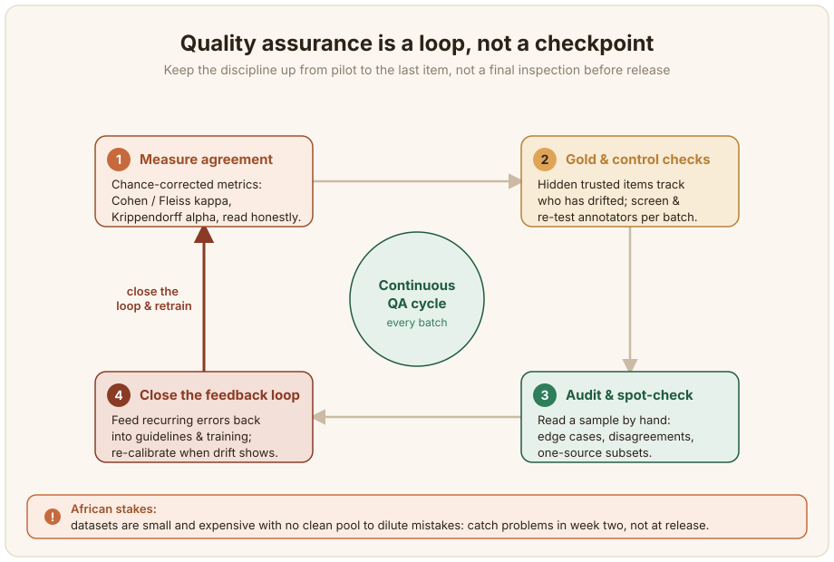

# Tabbatar da Ingancin Bayanai {#data-quality-assurance}

Inganci ba wani bincike na ƙarshe ba ne da kake yi kafin ka saki aiki. Wani tsari ne da kake kiyayewa tun daga farkon aikin har zuwa abu na ƙarshe. Ga bayanan harsunan Afirka masu ƙarancin kayan aiki (low-resource), muhimmancin hakan ya fi na yau da kullum, saboda kowane misali yana da tsadar samarwa kuma babu wani babban rumbun tsaftatattun bayanai da zai rage tasirin kurakurai. Lokacin da aka binciki wani babban aikin tattara bayanai daga intanet (web crawl), an gano cewa wani babban kaso na rubutun masu ƙarancin kayan aiki an yi musu lakabi (annotation) ba daidai ba, an fassara su da na'ura, ko kuma ba su ne ainihin harshen da ake buƙata ba sam ([Kreutzer et al., 2022](/references#kreutzer-2022)). Ƙaramin rumbun bayanai (dataset) da aka tabbatar da ingancinsa a tsanake ya fi babban rumbun da babu wanda ya bincika daraja nesa ba kusa ba. Wannan shafi yana duba ɓangaren tabbatar da inganci: auna jituwa (agreement), amfani da bayanan zinare (gold data), bincike da hannu, da kuma kammala tsarin.



## Auna jituwa tsakanin masu bayar da lakabi (inter-annotator agreement) {#measure-inter-annotator-agreement}

Lokacin da mutane da yawa suka bayar da lakabi ga abubuwa iri ɗaya, jituwa tana nuna maka ko lakabin abin dogaro ne ko kuma ra'ayin mutum ɗaya ne kawai aka maimaita. Yawan kason jituwa na asali yana da sauƙin karantawa amma yana yaudara, saboda wasu jituwar suna faruwa ne bisa tsautsayi, don haka yi amfani da ma'aunin da ke gyara tsautsayi: [Cohen's kappa](https://scikit-learn.org/stable/modules/generated/sklearn.metrics.cohen_kappa_score.html) ga masu bayar da lakabi biyu, [Fleiss' kappa](https://www.statsmodels.org/stable/generated/statsmodels.stats.inter_rater.fleiss_kappa.html) ga uku ko fiye, da kuma [Krippendorff's alpha](https://pypi.org/project/krippendorff/) lokacin da babu wasu lakabi ko kuma lakabin suna da tsari na mataki (ordinal). Ayyuka masu ingancin samarwa (production-grade) galibi suna sa ran samun alpha sama da 0.8, kodayake madaidaicin ma'auni ya dogara ne da yadda aikin yake buƙatar ra'ayin mutum (subjective). Rumbun bayanan Afirka suna nuna cikakken yanayin a aikace. MasakhaNER ta sami jituwa mai yawa ta hanyar horar da masu bayar da lakabi a bita inda suka tattauna rashin jituwa ([Adelani et al., 2022](/references#adelani-2022)), AfriSenti ta riƙe jituwar ra'ayi (sentiment) sama da 0.70 ([Muhammad et al., 2023](/references#muhammad-2023)), rumbun bayanai na Thiomi mai nau'o'i daban-daban (multimodal corpus) ya kiyaye Fleiss' kappa sama da 0.82 ([Thiomi Dataset, 2026](/references#thiomi-2026)), kuma AfriHate ta ba da rahoton Randolph's kappa tsakanin 0.46 da 0.81 a duk rumbun bayananta na kalaman ƙiyayya ([Muhammad et al., 2025](/references#afrihate-2025)). Ƙananan lambobi ba lallai ba ne su zama gazawa kai tsaye: a kan ayyukan da ke buƙatar ra'ayin mutum na gaskiya, za su iya nuna ainihin bambancin fassara maimakon sakaci ([Plank, 2022](/references#plank-2022)). Ƙididdiga da lambobin kwamfuta (code) da aka yi aiki da su suna cikin babi na ayyuka; a nan abin lura shi ne zaɓar madaidaicin ma'auni da kuma karanta shi da gaskiya.

Da zarar ka zaɓi ma'auni, lissafa shi a kan fayil ɗin lakabi da aka fitar yana da gajarta. Kayan aikin da ke amfani da tsarin Label Studio suna fitar da lakabi a matsayin JSON, don haka aiki yana ɗauke da lakabin da kowane mai bayar da lakabi ya ba shi. Rubutun kwamfuta (script) da ke ƙasa yana gina jadawalin mai bayar da lakabi-da-abu daga wannan fitarwar kuma yana ba da rahoton ƙididdigar da ta dace ga adadin masu bayar da lakabi, ta amfani da sanannun ɗakunan karatu (libraries) maimakon ƙididdigar da aka yi da hannu.

```python
import json
from collections import defaultdict

from sklearn.metrics import cohen_kappa_score   # pip install scikit-learn
from statsmodels.stats.inter_rater import fleiss_kappa, aggregate_raters


def load_labels(export_path: str, from_name: str = "sentiment") -> dict:
    """From a Label Studio-format JSON export, return
    {task_id: {annotator: label}} for one labeling field."""
    by_task = defaultdict(dict)
    with open(export_path, encoding="utf-8") as f:
        tasks = json.load(f)
    for task in tasks:
        for ann in task.get("annotations", []):
            who = ann.get("completed_by", "unknown")
            for result in ann.get("result", []):
                if result.get("from_name") != from_name:
                    continue
                choice = result["value"]["choices"][0]   # single-choice task
                by_task[task["id"]][who] = choice
    return by_task


def agreement(by_task: dict) -> None:
    # Keep only items every annotator labelled, so the comparison is fair.
    annotators = sorted({a for labels in by_task.values() for a in labels})
    shared = {t: l for t, l in by_task.items() if len(l) == len(annotators)}
    print(f"{len(annotators)} annotators, {len(shared)} commonly-labelled items")

    if len(annotators) == 2:
        a, b = annotators
        y1 = [shared[t][a] for t in shared]
        y2 = [shared[t][b] for t in shared]
        print(f"Cohen's kappa: {cohen_kappa_score(y1, y2):.3f}")
    else:
        # Fleiss' kappa expects an items x categories count table.
        table = [[shared[t][a] for a in annotators] for t in shared]
        counts, _ = aggregate_raters(table)
        print(f"Fleiss' kappa: {fleiss_kappa(counts):.3f}")


if __name__ == "__main__":
    agreement(load_labels("afriannotate_export.json"))
```

Karanta jituwa sau ɗaya a ƙarshe yana ɓoye sauyin yanayi (drift) da wannan babin yake gargaɗi a kai. Wannan fitarwar tana ɗauke da lokacin da aka yi lakabin, don haka ana iya raba jadawalin iri ɗaya zuwa rukuni ko ta lokaci kuma a ba shi maki daban, wanda shi ne ainihin yadda rumbun bayanan ra'ayi na Setswana ya nuna masu bayar da lakabi suna sannu a hankali suna bambanta a cikin rukunansa takwas ([Abdulmumin et al., 2026](/references#abdulmumin-2026)). Lokacin da lakabi suke na mataki ko masu bayar da lakabi suka tsallake abubuwa, musanya waɗannan ayyuka da Krippendorff's alpha (kunshin `krippendorff`), wanda ke kula da duka yanayi biyun da kappa ba ya yi.

## Yi amfani da bayanan zinare da binciken sarrafawa {#use-gold-data-and-control-checks}

Ma'aunin zinare (gold standard) wani tsari ne na abubuwa waɗanda ka riga ka amince da ingancin lakabinsu. Idan aka gauraya su a cikin tsarin bayar da lakabi ba tare da an nuna su ba, abubuwan zinare suna ba da ci gaba, karatu ga kowane mai bayar da lakabi a kan wanda har yanzu yake amfani da ƙa'idar da kuma wanda ya sauya, don haka za ka iya sake horarwa ko cire mai bayar da lakabi kafin kurakuransa su yaɗu a cikin bayanan. Gina tsarin zinare a tsanake, saboda yana zama abin dogaroka ga duk wani abu, kuma ka tuna cewa ko zinare ba cikakke ba ne: binciken rumbun bayanai na ma'auni (benchmark datasets) yana samun yawan kurakurai daga ƙasa da kashi ɗaya zuwa sama da goma, dangane da aikin. Tantance masu bayar da lakabi ta hanyar da kake bincika su, ta hanyar sa 'yan takara su ci gajeren gwajin lakabi kafin babban aikin da kuma ta hanyar sake nuna wasu 'yan abubuwa don auna daidaiton kowane mutum da kansa.

## Bincike da duba na musamman da hannu {#audit-and-spot-check-by-hand}

Jituwar gaba ɗaya tana iya yin kyau alhali wani abu na tsari yana da matsala a ɓoye, don haka kada ka amince da lambobi kawai. Ciro samfuri (sample) ka karanta shi. Batar da lokaci a wuraren da matsaloli suke ɓuya: lokuta masu wuya (edge cases), abubuwan da masu bayar da lakabi suka taru a kan rashin jituwa, da kowane ƙaramin tsari daga majiya ɗaya ko mai bayar da lakabi ɗaya. Binciken tattara bayanai daga intanet shi ne labarin gargaɗi a nan, tunda ɗan gajeren duban ɗan adam a kan samfuri ya fallasa cikakkun harsunan da tsarin na'ura ya wuce da su a matsayin masu tsafta ([Kreutzer et al., 2022](/references#kreutzer-2022)). 'Yan sa'o'i na karatu a tsanake suna kamo gazawar da babu wani ma'auni da zai fito da shi da kansa.

## Kammala tsarin bayar da shawarwari {#close-the-feedback-loop}

Tabbatar da inganci wani tsari ne mai ci gaba, ba wurin bincike ba. Bibiyi jituwa a tsawon rayuwar aikin maimakon a ƙarshe kawai, mayar da kowane kuskure da ke maimaita kansa a cikin ƙa'idodi da zagaye na gaba na horo, sannan a sake daidaitawa lokacin da masu bayar da lakabi suka fara bambanta. Sauyin yanayi (drift) gaskiya ne kuma ana iya auna shi, kuma maki ɗaya na jituwa a ƙarshen aiki zai iya ɓoye shi. A cikin rumbun bayanan ra'ayi na Setswana, jituwar gaba ɗaya ta yi kyau a κ = 0.76, duk da haka abubuwan da aka yi wa lakabi a cikin minti ɗaya da juna sun kai κ = 0.98 yayin da abubuwan da aka yi wa lakabi fiye da kwana ɗaya a tsakani suka faɗi zuwa κ = 0.65, wata bayyananniyar alama ce da ke nuna cewa masu bayar da lakabi sun bambanta a hankali a cikin rukunai takwas na aikin ([Abdulmumin et al., 2026](/references#abdulmumin-2026)). Dalilin ci gaba da sanya ido shi ne na tattalin arziki da kuma na ƙididdiga: matsalar da aka gano a mako na biyu tana cin ƙaramin kaso na kuɗin matsalar da aka gano a lokacin saki, lokacin da ta riga ta ɓata dukkan rumbun bayanan ([Sambasivan et al., 2021](/references#sambasivan-2021)).
