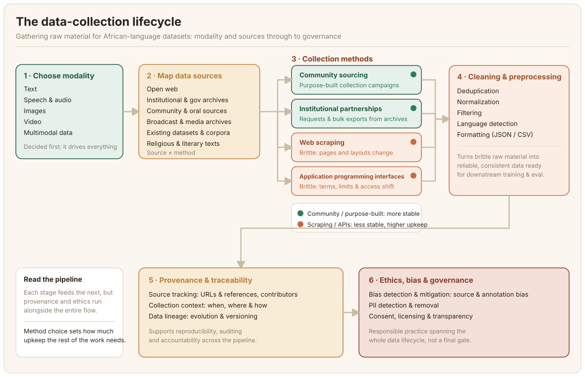

# Ukusanyaji wa Data {#data-collection}

Kila seti ya data (dataset) huanza kwa njia ile ile: lazima mtu aende na kupata nyenzo ghafi. Sura hii inahusu hatua hiyo ya kwanza, ambayo sehemu iliyosalia ya mwongozo huu inaiita **ukusanyaji wa data** (data collection) au **uratibu wa data** (data curation). Tunamaanisha hili kwa ufinyu: ule ukusanyaji halisi wa matini, picha, sauti, au video ghafi, kabla ya mtu yeyote kuisafisha, kuiwekea lebo, au kuamua maana yake. Kinachotokea baada ya ukusanyaji (usafishaji, uwekaji lakabi (annotation), udhibiti wa ubora, na utoaji) kinashughulikiwa katika sura zinazofuata.

Jinsi unavyokusanya data inategemea karibu kabisa na **mtindo** (modality) wake: umbizo ambalo data inachukua, iwe ni matini, picha, sauti, au video. Kila mtindo una vyanzo vyake, zana zake, na aina zake za hitilafu (failure modes), na mbinu inayofanya kazi vizuri kwa moja (kukwangua (scraping) tovuti za habari kwa ajili ya matini) inaweza kuwa karibu na kutofaa kwa nyingine (hakuna njia ya mkato sawa na "kukwangua wavuti" kwa sauti ya lugha inayozungumzwa katika lugha isiyo na utamaduni wa kuandikwa).

Sehemu zilizo hapa chini zinapitia vipengele vya msingi kwa mpangilio: ni mtindo gani unaokusanya, unaweza kutoka wapi, taratibu mbili za ukusanyaji zinazojulikana zaidi kwa kina (ukwanguaji wa wavuti (web scraping) na API), na uchunguzi kifani (case study) uliofanyiwa kazi unaoonyesha jinsi maamuzi haya yanavyoingiliana wakati mradi unahusisha zaidi ya mtindo mmoja kwa wakati mmoja. Sura inafungwa na kile kinachotokea mara tu data ghafi inapokuwa mkononi: kupanga rasilimali zilizohitajika kufika hapo, kuisafisha, kufuatilia ilikotoka, na kuisimamia kwa uwajibikaji.

