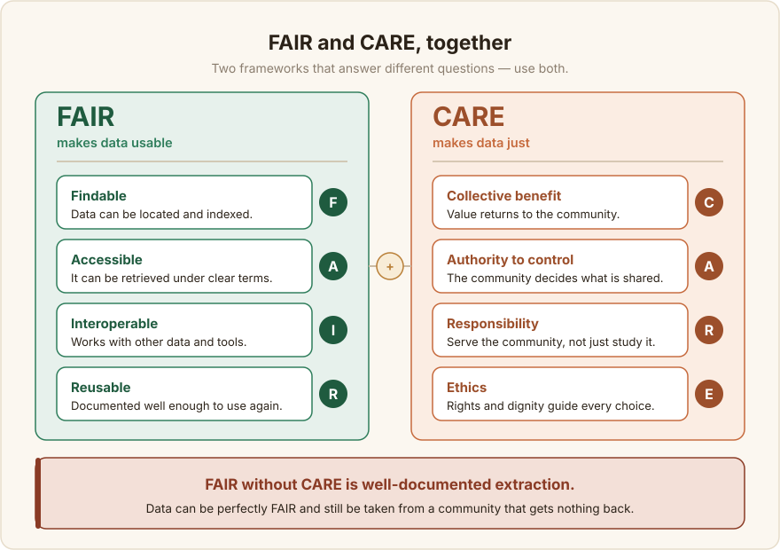

# Usimamizi wa Data {#data-governance}

Usimamizi wa data (data governance) ni seti ya maamuzi kuhusu nani anadhibiti seti ya data (dataset): nani anaweza kuifikia, nani anaweza kuitumia, nani anafaidika nayo, na nani anawajibika pale jambo linapoenda kombo. Kwa data za lugha za Kiafrika, haya si matakwa ya kisheria tu ya kuongezwa mwishoni. Yanaamua ikiwa seti ya data inaimarisha jamii au inachukua rasilimali zake kimyakimya. Data inatoka kwa watu, kutoka kwenye sauti zao, maneno, na maarifa yao, na usimamizi ni jinsi watu hao wanavyoendelea kuwa na sauti katika kile walichosaidia kukiunda.

Hili lina umuhimu zaidi hapa kuliko katika mazingira yenye rasilimali nyingi, kwa sababu uwazi uleule unaosaidia lugha yenye rasilimali chache (low-resource language) unaweza pia kuiweka hatarini. Kopasi (corpus) inayoweza kupakuliwa bila malipo ni rahisi kutumika tena, na ni rahisi vilevile kukwanguliwa (scrape) na kuingizwa kwenye modeli ya kibiashara ambayo hairudishi faida, sifa, au sauti yoyote kwa wazungumzaji. Jamii za Kiafrika za Uchakataji wa Lugha Asilia (NLP) zimekuwa wazi kuhusu hili. Jamii ya Masakhane inashikilia kuwa Waafrika wanapaswa kuamua ni data gani inawakilisha jamii zao, kubaki na umiliki wake, na kujua jinsi inavyotumika ([Masakhane](/sw/references#masakhane)). Usimamizi ni jinsi kanuni hiyo inavyobadilishwa kuwa vitendo.

:::tip[Toleo la mstari mmoja]
Amua pamoja na jamii nani anadhibiti data, pata idhini halisi, chagua leseni kwa makusudi, walinde watu waliomo kwenye data, na hakikisha manufaa yanawafikia wazungumzaji.
:::

## Simamia kwa ajili ya jamii, si kwa ajili ya seti ya data pekee {#govern-for-the-community-not-just-the-dataset}

### Umiliki wa jamii na kujiamulia {#community-ownership-and-self-determination}

Watu ambao lugha ni yao wanapaswa kuwa na kauli ya mwisho kuhusu jinsi data yao inavyotumika. Ahadi hii ya ushirikishwaji, inayowachukulia wazungumzaji asilia kama wamiliki wenza badala ya wasambazaji wa malighafi, inaonekana katika juhudi madhubuti zaidi za data barani. Iliunda kazi za awali za tafsiri za Masakhane ([Nekoto et al., 2020](/sw/references#nekoto-2020)), Programu ya Lugha za Kiafrika ya AI4D, ambayo iliunda seti za data wazi (open datasets) kupitia changamoto za kijamii na ushirika mfupi wa utafiti ([Siminyu et al., 2021](/sw/references#siminyu-2021)), na kopasi kubwa za matamshi kama vile NaijaVoices ambazo zinarekodiwa na wanakamati wa jamii badala ya kukwanguliwa ([Emezue et al., 2025](/sw/references#emezue-2025)). Pia inaakisi wito mpana wa kuondoa ukoloni katika teknolojia ya lugha kwa kuziweka kati jamii ambazo lugha zao ziko hatarini badala ya kuzichukulia kama vyanzo vya data ([Bird, 2020](/sw/references#bird-2020)). Kujiamulia si kura ya turufu moja wakati wa kutoa data. Kunaunda kila chaguo la awali: nini kinakusanywa, kutoka kwa nani, kwa masharti gani, na nani anaweza kutumia matokeo.

### FAIR na CARE, kwa pamoja {#fair-and-care-together}

Mifumo miwili inapaswa kuongoza muundo wa seti ya data, na inajibu maswali tofauti. FAIR inauliza ikiwa data Inapatikana (Findable), Inafikika (Accessible), Inashirikiana (Interoperable), na Inatumika tena (Reusable), na sasa ni matarajio ya msingi kwa data za utafiti ([Wilkinson et al., 2016](/sw/references#wilkinson-2016)). Hata hivyo, FAIR haisemi chochote kuhusu mamlaka au haki. Data inaweza kuwa FAIR kikamilifu na bado ikachukuliwa kutoka kwa jamii ambayo haipati chochote. CARE iliandikwa ili kuziba pengo hilo. Ahadi zake nne, Manufaa ya pamoja (Collective benefit), Mamlaka ya kudhibiti (Authority to control), Wajibu (Responsibility), na Maadili (Ethics), zinasisitiza haki ya jamii za asili na za mitaa kusimamia data zinazowahusu ([Carroll et al., 2020](/sw/references#carroll-2020)). Tumia zote mbili. FAIR inafanya data itumike; CARE inaifanya iwe ya haki. FAIR bila CARE ni unyonyaji uliorekodiwa vizuri.

Nusu ya upatikanaji ya FAIR ina makao ya vitendo katika NLP ya Kiafrika. African AI Atlas ya Lanfrica inafuatilia seti za data, modeli, na makala ambazo vinginevyo zingekuwa zimetawanyika kwenye hazina, PDF, na kurasa za miradi iliyokufa, ili kazi iliyokwisha fanywa iweze kupatikana na kutumika tena badala ya kujengwa upya kutoka mwanzo ([Lanfrica](/sw/references#lanfrica)).

## Idhini na haki {#consent-and-rights}

### Idhini yenye taarifa {#informed-consent}

Mtu yeyote anayechangia data, iwe ni rekodi ya sauti, tafsiri, uwekaji lakabi (annotation), au picha, anapaswa kujua kabla ya kuchangia kile anachokubaliana nacho: data ni kwa ajili gani, nani ataweza kuitumia, ikiwa itakuwa wazi kwa umma, na kwamba wanaweza kukataa au kujiondoa bila adhabu. Hili si la hiari kwa ukusanyaji unaotegemea rekodi ambao ni wa kawaida katika kazi za lugha za Kiafrika, ambapo sauti au picha ya mchangiaji ndiyo data yenyewe. NaijaVoices inaonyesha jinsi utendaji mzuri unavyoonekana. Ili kuunda kopasi ya matamshi ya saa 1,800 ya Kiigbo, Kihausa, na Kiyoruba kutoka kwa wafadhili wa sauti zaidi ya 5,000, ilitoa mafunzo kwa wawezeshaji wa jamii kuhusu maadili ya ukusanyaji wa data na idhini yenye taarifa (informed consent), na wawezeshaji hao walielezea mradi, madhumuni yake, na matumizi yaliyokusudiwa ya data kwa kila mchangiaji kabla ya rekodi yoyote kuanza ([Emezue et al., 2025](/sw/references#emezue-2025)). Kusanya idhini yenye taarifa, fidia ya haki, na masharti wazi ya haki za data kwa pamoja, wakati wa ukusanyaji ([Esethu Framework, 2025](/sw/references#esethu-2025)). Kuongeza idhini baadaye kwa kawaida haiwezekani, jambo ambalo linafanya huu uwe uamuzi wa mapema badala ya uamuzi wa kuchelewa.

### Haki juu ya data iliyotafutwa na iliyochangiwa {#rights-over-sourced-and-contributed-data}

Kuwa wazi kuhusu aina ya data unayoshikilia, kwa sababu haki zinatofautiana sana. Data iliyochangiwa, yaani rekodi, nakala, na lebo ambazo watu wanatengeneza kwa ajili ya mradi wako, inasimamiwa na idhini na masharti mnayokubaliana nao. Data iliyotafutwa, yaani maandishi yaliyotolewa kwenye mtandao, mitandao ya kijamii, au nyaraka, inabeba haki za mtu mwingine: hakimiliki (copyright), masharti ya huduma ya jukwaa, na mara nyingi hakuna leseni wazi kabisa. Wataalamu wa NLP wa Kiafrika wamebainisha hakimiliki na ufikiaji kama tatizo kuu ambalo halijatatuliwa, kwani maandishi mengi yanayopatikana yapo katika eneo lenye utata kisheria na "kuonekana hadharani" si sawa na "kuwa huru kusambaza tena au kufanyia mafunzo" ([Carnegie Endowment, 2024](/sw/references#carnegie-2024)). Wakati haki haziko wazi, rekodi kutokuwa na uhakika huko badala ya kukuficha.

## Utoaji wa Leseni {#licensing}

Leseni (licence) inauambia ulimwengu kile kinachoweza na kisichoweza kufanywa na data yako. Katika NLP ya Kiafrika, kutofaulu kwa kawaida si leseni mbaya bali ni kukosekana au kutokuwa wazi kwa leseni, na seti ya data isiyo na leseni kimsingi haiwezi kutumika, kwa sababu mtumiaji wa pili hawezi kujua kama anaruhusiwa kuigusa ([Lanfrica, "Licensing as a Barrier"](/sw/references#lanfrica-licensing)). Chagua kwa makusudi.

### Data na kodi zinapewa leseni tofauti {#data-and-code-are-licensed-differently}

Leseni za programu kama vile MIT au Apache-2.0 hazijajengwa kwa ajili ya data, na kuweka leseni ya kodi kwenye kopasi kunaacha haki zake za kutumika tena zikiwa na utata. Kwa data wazi (open data), familia ya Creative Commons ndiyo chaguo la kawaida: CC0 kwa ajili ya kujitolea kwa uwanja wa umma, CC BY kwa matumizi tena kwa kutoa sifa, au CC BY-SA kwa kutoa sifa pamoja na kushiriki sawa. Chagua ile inayolingana na jinsi unavyotaka kuwa wazi hasa, na uitumie kwenye data, tofauti na kodi yoyote.

### Leseni za Kiafrika na za jamii {#african-and-community-licences}

Leseni za CC zilizo wazi kikamilifu zinachukulia kuwa lengo ni matumizi ya juu zaidi. Kwa data za Kiafrika zenye rasilimali chache, matumizi ya juu zaidi mara nyingi inamaanisha maabara ya kigeni yenye ufadhili mzuri inaweza kuchukua kopasi, kuifanyia mafunzo, na kutowarudishia chochote wazungumzaji. Daraja jipya la leseni zinazozingatia jamii lipo ili kuziba pengo hilo, na iliyoendelea zaidi kati ya hizo ni ya Kiafrika.

Nwulite Obodo Open Data License (NOODL) inachukua jina lake kutoka kwa Kiigbo linalomaanisha "kuinua, kufufua, na kujenga jamii," na iliandikwa ili kushughulikia uwazi usio wa haki ambao leseni za kawaida zinawawekea waundaji wa seti za data za Kiafrika ([NOODL, 2025](/sw/references#noodl-2025)). Wazo lake kuu ni kuweka masharti kulingana na nani anayetumia tena. Watumiaji barani Afrika na mataifa mengine yanayoendelea wanaweza kutumia data tena kwa uhuru kwa msingi wa kushiriki sawa na kusambaza marekebisho ndani ya kanda. Watumiaji nje ya kanda hizo wanakubali masharti hayohayo ya kushiriki sawa na lazima pia warudishe mirabaha au manufaa mengine kwa wamiliki wa seti za data za Kiafrika. Uwazi unakuwa wa pande zote mbili badala ya usafirishaji wa njia moja.

Leseni ya Esethu, kutoka Lelapa AI, Way With Words, na Data Science for Social Impact, inaongeza mzunguko wa kiuchumi: mapato ya leseni yanawekezwa tena katika kupanua seti ya data na kusaidia ajira za ndani, hivyo rasilimali na jamii yake vinakua pamoja ([Esethu Framework, 2025](/sw/references#esethu-2025)). Zote mbili zinajengwa juu ya mfano wa Kaitiakitanga License ya Te Hiku Media kwa data za Wamaori, ambayo inachukulia data kama inayotunzwa badala ya kumilikiwa, inaelekeza manufaa nyuma kwa jamii chanzo, na inakataza matumizi kama vile ufuatiliaji au uundaji wa kopasi bila idhini ([Te Hiku Media](/sw/references#tehiku-kaitiakitanga)). Fikiria mojawapo ya hizi wakati wowote leseni ya kawaida ya CC ingemaanisha kuachia sauti ya jamii, au sehemu yake ya thamani ambayo data yake inaunda.

### Kutoa sifa na matumizi tena {#attribution-and-reuse}

Leseni yoyote unayochagua, hitaji kutoa sifa na kurekodi asili (provenance): data ilitoka wapi, nani aliichangia, na kwa masharti gani. Asili inaruhusu watumiaji wa baadaye (downstream users) kutoa sifa kwa chanzo na kuheshimu masharti, na inakuruhusu kuthibitisha miaka kadhaa baadaye kwamba seti ya data ilijengwa kihalali. Kurekodi hili kunashughulikiwa katika [Nyaraka](/sw/documentation/documentation).

## Faragha na data nyeti {#privacy-and-sensitive-data}

### Taarifa zinazotambulisha mtu binafsi {#personally-identifiable-information}

Ukusanyaji wa lugha za Kiafrika mara kwa mara unanasa data za kibinafsi: majina na maeneo katika maandishi, na, bila kuepukika, sauti katika sauti na nyuso katika picha, ambazo zinamtambulisha mtu moja kwa moja. Kusanya kiasi kidogo tu kadiri kazi inavyohitaji, ficha utambulisho (anonymise) pale unapoweza kwa kuficha majina na kuondoa metadata, na kamwe usichukulie sauti iliyorekodiwa kama isiyotambulika. Pale ambapo data inayotambulika ni muhimu, lazima itegemee idhini ya wazi, yenye taarifa, na masharti ya idhini lazima yasafiri pamoja na data.

### Maudhui nyeti na yaliyozuiliwa {#sensitive-and-restricted-content}

Baadhi ya maarifa hayapaswi kuwa wazi kwa umma hata kama ni rahisi kuyakusanya. Nyenzo takatifu au za sherehe, maarifa yaliyozuiliwa kiutamaduni, taarifa za afya, na matamshi hatari kisiasa yote yanaweza kuwaweka wachangiaji katika hatari ya kweli. Hiki ndicho Mamlaka ya kudhibiti ya CARE inalinda: jamii, si mkusanyaji, inaamua nini kinaweza kushirikiwa na nini kinabaki kimefungwa ([Carroll et al., 2020](/sw/references#carroll-2020)). Unapokuwa na shaka, uliza jamii na chagua kutotoa data kama msingi.

### Sheria inayotumika: Mifumo ya ulinzi wa data ya Kiafrika {#the-law-that-applies-african-data-protection-regimes}

Kote barani, usimamizi sasa ni sheria sawa na maadili. Kufikia 2026, nchi 44 za Kiafrika zilikuwa zimetunga sheria za ulinzi wa data, na nyingi zilikuwa na mamlaka inayofanya kazi kuitekeleza ([Tech In Africa, 2026](/sw/references#techinafrica-2026)). Ikiwa unakusanya data za kibinafsi, na sauti iliyorekodiwa ni data ya kibinafsi, karibu hakika unashughulikiwa na mojawapo ya mifumo hii:

- **Afrika Kusini, POPIA** (Protection of Personal Information Act, 2020): sheria inayozingatia haki ambayo inahitaji msingi wa kisheria, ukomo wa madhumuni, na tathmini ya athari kwa uchakataji wa kiotomatiki.
- **Nigeria, Data Protection Act (2023)**, ikijengwa juu ya NDPR ya awali: idhini, haki za mhusika wa data (data-subject rights), na usajili wa wadhibiti wa data (data controllers).
- **Kenya, Data Protection Act (2019)** na kanuni zake za 2021, pamoja na Mkakati wa Kitaifa wa AI wa 2025–2030, ambao unaongeza matarajio katika kiwango cha seti ya data ikijumuisha mapendekezo ya njia za ukaguzi kwa data za mafunzo ya AI.
- **Ghana, Data Protection Act (2012)**: mojawapo ya sheria za awali kabisa barani.
- **Umoja wa Afrika, Malabo Convention**: mkataba wa kwanza wa bara zima kuhusu ulinzi wa data za kibinafsi na usalama wa mtandao, unaotumika tangu Juni 2023 ([Malabo Convention, 2023](/sw/references#malabo-2023)).

Matakwa ya vitendo yanafanana katika sheria hizi: kusanya kwa msingi wa kisheria, kwa kawaida idhini yenye taarifa; tumia data tu kwa madhumuni uliyotaja; heshimu haki za mhusika wa data za kufikia, kusahihisha, na kufuta; na uwe tayari kufanya tathmini ya athari kwa chochote kinacholisha maamuzi ya kiotomatiki. Angalia sheria ya kila nchi ambayo wachangiaji wako wapo, si yako tu. African Next Voices inafanya hoja hii kuwa thabiti. Ilikusanya takriban saa 9,000 za matamshi kote Kenya, Nigeria, na Afrika Kusini ([African Next Voices, 2025](/sw/references#african-next-voices)), jambo ambalo liliweka mradi mmoja chini ya mifumo mitatu tofauti ya ulinzi wa data kwa wakati mmoja.

## Maadili na kuepuka madhara {#ethics-and-harm-avoidance}

### Mapitio mepesi ya maadili {#a-lightweight-ethics-review}

Kabla ya ukusanyaji kuanza, fanya mapitio mafupi na ya kweli: nani anaweza kudhurika na seti hii ya data, vipi, na nini kitapunguza hatari. Haihitaji kuwa bodi rasmi ya taasisi, ambayo miradi mingi ya jamii haiwezi kuifikia, lakini inahitaji kufanyika kabla ya data kukusanywa, wakati chaguzi bado ni rahisi kubadilishwa. Jinsi kazi inavyofanywa, na nani anashauriwa njiani, mara nyingi huamua ikiwa jamii inahudumiwa kikweli au inasomwa tu, jambo ambalo ahadi za Wajibu na Maadili za CARE zinakuomba uzingatie ([Carroll et al., 2020](/sw/references#carroll-2020)).

### Upendeleo, uwakilishi, na madhara {#bias-representation-and-harm}

Uliza nani anawakilishwa kwenye data na nani anakosekana, katika lahaja, mikoa, jinsia, na umri, kwa sababu mapengo hayo yanakuwa maeneo yasiyoonekana ya modeli yoyote iliyofunzwa kwayo. Kazi zinazohusisha maudhui hatari, kama vile matamshi ya chuki au lugha ya kuudhi, zinabeba wajibu wa pili wa uangalizi kwa waweka lakabi (annotators) ambao wanapaswa kuyasoma, unaotimizwa kupitia maonyo ya maudhui, fursa za kujiondoa, na msaada (tazama sura za uwekaji lakabi). Kurekodi upendeleo unaojulikana waziwazi ni sehemu ya usimamizi, si kukubali kushindwa.

## Umiliki wa jamii na kugawana manufaa {#community-ownership-and-benefit-sharing}

### Mifumo ya usimamizi {#governance-models}

Amua kwa maandishi nani anaamua, na weka mamlaka hayo kwa jamii. Katika vitendo hii inaweza kuwa bodi ya ushauri ya jamii, kiongozi wa lugha aliyeteuliwa kwa kila lugha, au mpangilio rasmi wa udhamini wa data, na mfumo sahihi unategemea ukubwa wa mradi na muundo wa jamii. Jambo la msingi ni kwamba haki za maamuzi ziwe wazi na zishikiliwe na watu ambao lugha ni yao, badala ya kumuachia yeyote anayehifadhi faili hizo.

### Kugawana manufaa na kutoa sifa {#benefit-sharing-and-credit}

Usimamizi ni mtupu ikiwa thamani inatiririka nje pekee. Kugawana manufaa inamaanisha faida kutoka kwenye seti ya data, iwe ni utambuzi, fidia, uwezo, zana, au sehemu ya thamani ya baadaye, inarudi kwa wachangiaji na jamii yao. Hili ndilo wazo la kuandaa nyuma ya kanuni ya Kaitiakitanga License kwamba manufaa yanatiririka kwenye chanzo, uwekezaji upya wa mapato ya leseni wa mfumo wa Esethu kwenye seti ya data na ajira za ndani, na mfumo wa "ukulima wa data" wa NaijaVoices, ambao unaunganisha ukusanyaji na msaada wa jamii wa pande zote na ruzuku ndogo kwa kazi za lugha za ndani ([Te Hiku Media](/sw/references#tehiku-kaitiakitanga); [Esethu Framework, 2025](/sw/references#esethu-2025); [Emezue et al., 2025](/sw/references#emezue-2025)). Kwa uchache, wape sifa waweka lakabi, wazungumzaji, na jamii kwa majina katika karatasi za data na machapisho. Wao ni waundaji wenza, na kuwataja ni ugawanaji manufaa wa bei nafuu zaidi uliopo.

:::note[Jinsi hii inavyoungana]
Maamuzi ya usimamizi yanayofanywa hapa yanaweka masharti kwa kila kitu cha baadaye: nini unaweza [kukusanya](/sw/data-collection/data-modalities), jinsi unavyoendesha [uwekaji lakabi](/sw/annotation-design/annotation-task-design), na nini unarekodi katika [Nyaraka](/sw/documentation/documentation). Fanya usimamizi kwa usahihi mapema na mradi uliosalia utasimama kwenye msingi imara.
:::
